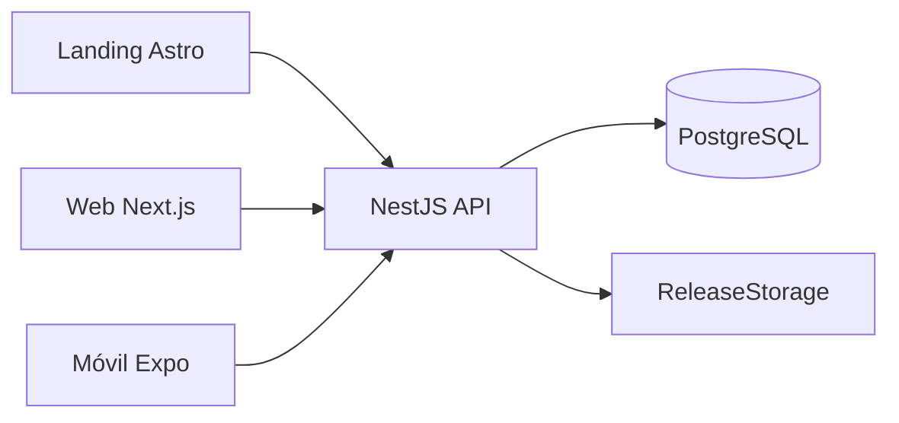

# GarFit

**Entrena · Registra · Evoluciona.** GarFit es una plataforma web y móvil orientada al
atleta para registrar entrenamientos y marcas personales, consultar evolución y obtener
análisis personalizados mediante inteligencia artificial.

GarFit es actualmente un prototipo académico y no constituye una aplicación oficial de la Universidad Autónoma de Tlaxcala.

## Estado

La fase 1 implementa infraestructura y el recorrido landing → web → registro/login →
perfil → dashboard; en móvil, login/registro → sesión → inicio → perfil; distribución
Android y frontera de IA. Aún no implementa catálogo de movimientos, entrenamientos,
resultados, PRs, historial, estadísticas, evolución ni asistente IA. No es un sistema de
gimnasios: no incluye membresías, pagos, reservaciones, clases, coaches, POS, inventario,
torniquetes, biometría, leaderboards públicos, multi-gym ni SaaS.

## Arquitectura



Consulte [documentación de arquitectura](docs/architecture/system-context.md),
[decisiones](docs/adr/README.md) y [trazabilidad](docs/TRACEABILITY.md).

| Área | Tecnología / responsabilidad |
| --- | --- |
| `apps/api` | NestJS 12, Prisma 7, PostgreSQL, autenticación, perfil y releases |
| `apps/web` | Next.js 16, interfaz web y cookies httpOnly |
| `apps/mobile` | Expo SDK 57, React Native, SecureStore |
| `apps/landing` | Astro 7, sitio público y CTA Android |
| `packages/types` | Contratos de API |
| `packages/validation` | Esquemas Zod y constantes |
| `packages/api-client` | Cliente fetch tipado |
| `packages/config` | Configuración ESLint compartida |

## Requisitos

Node >=22.12 (desarrollo con 24), pnpm 11.20 y Docker. El monorepo usa TypeScript 6,
Turborepo 2.10 y PostgreSQL 17.

## Instalación y entorno

```sh
pnpm install
pnpm db:up
pnpm db:migrate
pnpm dev
```

Docker inicia PostgreSQL en `localhost:5442` y prepara las bases `garfit` y `garfit_test`.
Los servicios locales usan API `4000`, web `3000`, landing `4321` y Expo `8081`.

| Aplicación | Variables relevantes |
| --- | --- |
| API | `DATABASE_URL`, `TEST_DATABASE_URL`, `JWT_ACCESS_SECRET`, `CORS_ORIGINS`, `GOOGLE_WEB_CLIENT_ID`, `GOOGLE_EXTRA_AUDIENCES`, `GEMINI_API_KEY`, `GEMINI_MODEL` |
| Web | Configure la URL de API conforme a su entorno; no guarde tokens en variables públicas. |
| Landing | `PUBLIC_WEB_APP_URL`, `PUBLIC_API_URL` |
| Móvil | `EXPO_PUBLIC_API_URL`, `EXPO_PUBLIC_GOOGLE_WEB_CLIENT_ID` |

Revise `apps/api/.env.example`, `apps/landing/.env.example` y
`apps/mobile/.env.example`; nunca versione `.env` ni secretos.

## Comandos

| Comando | Acción |
| --- | --- |
| `pnpm dev` | Ejecuta aplicaciones en desarrollo |
| `pnpm build` | Compila el monorepo |
| `pnpm lint` / `pnpm typecheck` | Verifica estilo y tipos |
| `pnpm test` / `pnpm test:coverage` | Ejecuta pruebas y cobertura |
| `pnpm docs:generate` | Genera OpenAPI, ERD, TypeDoc, cobertura y metadatos |
| `pnpm docs:check` | Verifica OpenAPI/ERD actualizados |

La documentación académica, técnica y generada se explica en [docs](docs/README.md).

## Publicación Android

La APK se publica únicamente por CLI, nunca mediante endpoint HTTP:

```sh
pnpm --filter @garfit/api release:publish -- --file ruta/app.apk \
  --version 1.0.0 --version-code 1 --changelog "Cambios"
```

Use `--draft` para mantenerla no publicada. La landing sólo muestra releases publicados.

## Google OAuth

Está pendiente crear el proyecto en Google Cloud y configurar pantalla de consentimiento.
Defina el client ID Web en `GOOGLE_WEB_CLIENT_ID` (API) y
`EXPO_PUBLIC_GOOGLE_WEB_CLIENT_ID` (móvil), autorice `http://localhost:3000`, y agregue
la audiencia Android basada en SHA-1 a `GOOGLE_EXTRA_AUDIENCES` si difiere. En móvil,
Google funciona sólo en Development Build, no Expo Go. No se utiliza client secret.
