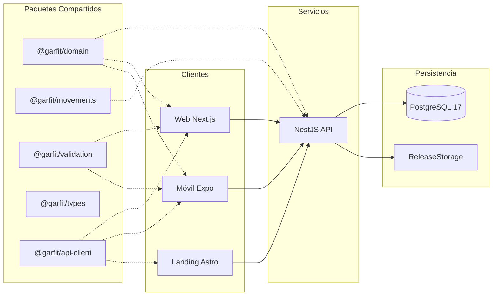

# GarFit

**Entrena · Registra · Evoluciona.** GarFit es una plataforma web y móvil orientada al
atleta para registrar entrenamientos y marcas personales, consultar evolución y obtener
análisis personalizados mediante inteligencia artificial.

GarFit es actualmente un prototipo académico y no constituye una aplicación oficial de la Universidad Autónoma de Tlaxcala.

## Estado (Fase 3: entrenamientos, WODs y progreso)

La **fase 2** implementa el núcleo del dominio deportivo para el atleta:
- **Catálogo de movimientos:** 1319 movimientos normalizados con búsqueda por texto, filtros combinados (categoría, equipamiento, tipo de marca, dificultad, grupos musculares) y paginación determinista.
- **Marcas personales (`PersonalRecord`):** registro estructurado de marcas en cinco modalidades (`WEIGHT`, `REPS`, `DISTANCE`, `DURATION`, `TIME`) con unidades métricas e imperiales (kg, lb, m, km, mi, s), almacenamiento exacto del valor original y cálculo de valor canónico normalizado.
- **Historial y progreso:** agrupación en series comparables (separando repeticiones en marcas de peso, p. ej. 1RM y 5RM), orden cronológico estable, detección de mejoras y regresiones, cálculo de cambio relativo/porcentual y gráficas SVG de evolución.
- **Trazabilidad y borrado lógico:** las marcas nunca se sobrescriben; las correcciones se realizan vía `PATCH` y los retiros mediante borrado lógico (`deletedAt`).
- **Perfil deportivo ampliado:** preferencias de unidades (`METRIC` o `IMPERIAL`), medidas antropométricas (altura en cm, peso en kg) y fechas de nacimiento e inicio de entrenamiento.
- **Resumen en dashboard:** visualización de totales, marcas recientes y última mejora alcanzada.
- **Frontera de IA:** servicio `ProgressSnapshotService` para generar resúmenes estructurados de progreso determinista listos para contextualizar modelos de lenguaje sin delegarles cálculos numéricos.

La fase 3 incorpora entrenamientos personales (`Workout`) y plantillas (`Wod`), resultados por serie, score por modalidad, historial, estadísticas y marcas automáticas trazables. La comparación de `TIME` exige la misma distancia. El asistente interactivo con Gemini permanece pendiente; el snapshot determinista está preparado como frontera futura.

Los benchmarks incluidos son definiciones de uso común redactadas por el proyecto y no tienen afiliación con marcas.

**Fuera de alcance:** GarFit está enfocado exclusivamente en el progreso del atleta individual; no es un sistema de gestión de gimnasios (no incluye membresías, cobros, reservas, control de acceso por torniquetes, clases grupales ni esquemas multi-tenant SaaS).

## Arquitectura



Consulte la [documentación del dominio del atleta](docs/architecture/athlete-domain.md), [contexto del sistema](docs/architecture/system-context.md), [decisiones arquitectónicas (ADR)](docs/adr/README.md) y la [matriz de trazabilidad](docs/TRACEABILITY.md).

| Área / Paquete | Tecnología | Responsabilidad principal |
| --- | --- | --- |
| `apps/api` | NestJS 12, Prisma 7, PostgreSQL | Endpoints REST, autenticación JWT/Google, perfil, movimientos, marcas y releases |
| `apps/web` | Next.js 16 (React 19), Tailwind | Aplicación web del atleta, proxy perimetral y cookies httpOnly |
| `apps/mobile` | Expo SDK 57 (React Native 0.86) | Aplicación móvil nativa del atleta con almacenamiento seguro en SecureStore |
| `apps/landing` | Astro 7, Tailwind 4 | Portal informativo público y distribución de instaladores Android |
| `packages/domain` | TypeScript (puro, 0 dependencias) | Reglas de negocio, límites, enums, conversión de unidades y cálculo de progreso |
| `packages/movements` | TypeScript, JSON | Taxonomía de ejercicios, reglas de marcas y catálogo de 1319 movimientos |
| `packages/types` | TypeScript | Definición de contratos e interfaces de transferencia (DTOs) |
| `packages/validation` | Zod 4 | Esquemas de validación compartidos para formularios de cliente |
| `packages/api-client` | TypeScript, fetch nativo | Cliente HTTP tipado para consumo de la API REST |
| `packages/config` | ESLint 9 | Configuraciones de linting y formateo compartidas |

## Catálogo de movimientos y aviso de terceros

El catálogo (`packages/movements/data/catalog.json`) contiene 1319 movimientos procesados de forma reproducible mediante `packages/movements/scripts/import-catalog.mjs` a partir del conjunto de datos abierto **hasaneyldrm/exercises-dataset** (commit fijado `7455efae41b330c265e7cd4b78dfa848e7ce5ebd`), publicado bajo **Licencia MIT**.

- **Transformaciones aplicadas:** normalización a español de instrucciones y categorías corporales, unificación de sinónimos musculares, descarte de variantes de ángulo de cámara (1324 ejercicios originales − 5 variantes = 1319 movimientos) y derivación determinista de tipos de marca admitidos.
- **Exclusión de recursos multimedia:** las imágenes y videos del repositorio original son propiedad intelectual de *Gym visual ©* y están expresamente excluidos de GarFit. El sistema no almacena, no enlaza ni distribuye dicha multimedia.
- Los detalles completos de licencia y atribución constan en [`packages/movements/data/THIRD_PARTY_NOTICE.md`](packages/movements/data/THIRD_PARTY_NOTICE.md).

## Requisitos del entorno

- **Node.js:** `>=22.12` (desarrollo probado sobre Node 24).
- **pnpm:** `11.20.0` (gestor de paquetes del monorepo).
- **Docker / Docker Compose:** para inicializar el contenedor PostgreSQL 17.
- **Playwright Chromium:** para ejecución de pruebas de extremo a extremo (`pnpm exec playwright install chromium`).

## Instalación y puesta en marcha

```sh
pnpm install
pnpm db:up
pnpm db:migrate
pnpm db:seed
pnpm dev
```

1. `pnpm db:up`: Levanta PostgreSQL en el puerto local `5442` (bases `garfit` y `garfit_test`).
2. `pnpm db:migrate`: Aplica las migraciones de Prisma en la base de datos de desarrollo.
3. `pnpm db:seed`: Carga idempotentemente 1319 movimientos, siete curados y seis WODs benchmark.
4. `pnpm dev`: Inicia concurrentemente la API (`localhost:4000`), la Web (`localhost:3000`) y la Landing (`localhost:4321`) con recarga en vivo de paquetes.

Para iniciar la aplicación móvil Expo (que requiere terminal interactiva):
```sh
pnpm dev:mobile
```

### Semilla para demostración

Para inicializar un atleta con marcas históricas plausibles (útil para pruebas manuales y demostraciones):
```sh
DEMO_USER_PASSWORD="UnaContraseñaSegura123" pnpm db:seed:demo
```
*Nota:* `db:seed:demo` exige el catálogo sembrado previamente, valida una longitud mínima de 8 caracteres y se bloquea automáticamente si `NODE_ENV === 'production'`.

## Scripts disponibles

| Script | Propósito y comportamiento |
| --- | --- |
| `pnpm dev` | Inicia API, web y landing en paralelo (excluye móvil) |
| `pnpm dev:api` | Inicia exclusivamente la API NestJS con sus dependencias |
| `pnpm dev:web` | Inicia exclusivamente la aplicación web Next.js |
| `pnpm dev:landing` | Inicia la landing page Astro (en segundo plano ante agentes IA, en primer plano en terminal humana) |
| `pnpm dev:mobile` | Compila dependencias e inicia el servidor Expo en modo interactivo |
| `pnpm build` | Compila todos los paquetes y aplicaciones del monorepo (5 tareas) |
| `pnpm lint` | Ejecuta validación estática de código con ESLint 9 |
| `pnpm typecheck` | Comprueba tipado estático de TypeScript en todo el monorepo (11 tareas) |
| `pnpm test` | Ejecuta la suite completa de pruebas automatizadas con Vitest (195 pruebas) |
| `pnpm test:coverage` | Genera reportes de cobertura de código para API, web y paquetes |
| `pnpm evidence:web` | Ejecuta todos los flujos E2E de Playwright y produce capturas de evidencia |
| `pnpm db:seed` | Siembra idempotente del catálogo, curados y WODs benchmark |
| `pnpm db:seed:demo` | Crea el usuario demo con marcas de prueba (requiere `DEMO_USER_PASSWORD`) |
| `pnpm docs:generate` | Regenera contratos OpenAPI, diagrama ERD, TypeDoc y resumen de cobertura |
| `pnpm docs:check` | Comprueba que los artefactos generados versionados coincidan con el código |

## Evidencias de pruebas

Los reportes de verificación con resultados inmutables y capturas fechadas se conservan en:
- [Evidencia de fase 1 (2026-09-16)](docs/evidence/fase-1/pruebas-2026-09-16.md)
- [Evidencia de fase 2 (2026-09-16)](docs/evidence/fase-2/pruebas-2026-09-16.md) y [capturas del recorrido E2E](docs/evidence/fase-2/capturas/)
- [Evidencia de fase 3 (2026-09-17)](docs/evidence/fase-3/pruebas-2026-09-17.md) y [capturas del recorrido E2E](docs/evidence/fase-3/capturas/)

## Publicación de instalador Android

La publicación de APKs se gestiona exclusivamente por línea de comandos (CLI) autenticada:

```sh
pnpm --filter @garfit/api release:publish -- --file ruta/app.apk \
  --version 1.0.0 --version-code 1 --changelog "Versión inicial"
```

El parámetro `--draft` conserva el archivo sin visibilidad pública. La landing page y los clientes consultan únicamente la versión publicada con el mayor `versionCode`.

## Estado de la fase 4: análisis explicativo con IA

La fase 4 incorpora análisis de progreso y entrenamiento, explicación de WOD y movimiento, evidencia inspeccionable y creación de WOD personal desde la web. La IA requiere consentimiento explícito y revocable; GarFit calcula los hechos deportivos y el modelo sólo los interpreta. Sin clave del proveedor, el servicio de IA informa que no está configurado y el resto de la plataforma continúa funcionando.

Las variables de configuración son `GEMINI_ENABLED`, `GEMINI_API_KEY`, `GEMINI_MODEL`, `AI_PROVIDER`, `AI_TIMEOUT_MS`, `AI_RATE_LIMIT_PER_MINUTE` y `AI_RATE_LIMIT_PER_DAY`. El proveedor simulado permite pruebas locales; la comprobación real con Gemini permanece PENDIENTE porque no hay clave configurada. Este repositorio sigue siendo un prototipo académico y no constituye una aplicación oficial de la Universidad Autónoma de Tlaxcala.

Consulte el [flujo de IA](docs/architecture/ai-flow.md), el [ADR 0009](docs/adr/0009-ai-analysis-architecture.md) y la [evidencia de fase 4](docs/evidence/fase-4/pruebas-2026-09-17.md).
