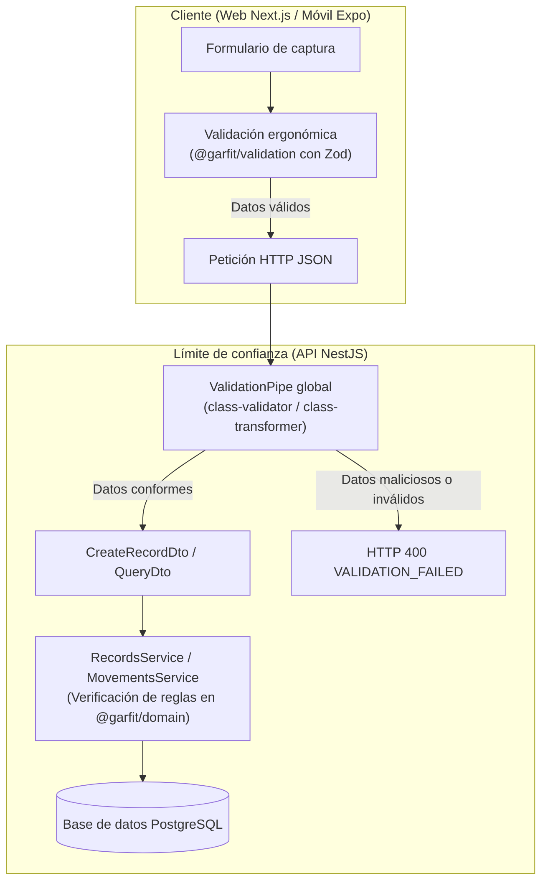

# 6. Diseño del sistema

## 6.1 Arquitectura por capas y paquetes compartidos

El sistema GarFit adopta una arquitectura desacoplada organizada en cuatro capas principales: presentación, aplicación, dominio compartido y persistencia. Esta disposición separa estrictamente las responsabilidades de interfaz de usuario de las reglas de cálculo deportivo y la persistencia de datos:

1. **Capa de presentación:** Comprende tres aplicaciones cliente diseñadas para propósitos específicos:
   - `apps/landing`: Sitio web estático e interactivo desarrollado en Astro 7 y Tailwind CSS, enfocado en la divulgación pública del proyecto y la distribución del instalador móvil Android.
   - `apps/web`: Aplicación web responsiva desarrollada en Next.js 16 (React 19), orientada a la interacción completa del atleta (gestión de perfil, exploración del catálogo, registro de marcas y visualización de progreso con gráficas SVG). Emplea un proxy perimetral (`proxy.ts`) y acciones de servidor para gestionar credenciales en cookies seguras `httpOnly`.
   - `apps/mobile`: Aplicación móvil nativa desarrollada con Expo SDK 57 y React Native, que utiliza `SecureStore` para el almacenamiento encriptado de credenciales y provee navegación fluida basada en pestañas y pilas de navegación protegidas.
2. **Capa de aplicación (API backend):** Construida sobre NestJS 12 y TypeScript dentro de `apps/api`. Expone una interfaz RESTful estructurada en módulos de funcionalidad cohesivos: salud (`health`), autenticación e identidad (`auth`), perfil deportivo (`profile`), catálogo de movimientos (`movements`), marcas personales y progreso (`records`), distribución de ejecutables (`releases`) y la frontera de análisis inteligente (`ai`). La API constituye el único límite de confianza con acceso directo a la base de datos.
3. **Capa de dominio y contratos compartidos:** Estructurada en bibliotecas internas independientes dentro del directorio `packages/`:
   - `@garfit/domain`: Núcleo de lógica deportiva y reglas de negocio puras, sin dependencias externas ni código atado a ningún framework.
   - `@garfit/movements`: Taxonomía de ejercicios, catálogo inmutable de 1319 movimientos y algoritmos deterministas de clasificación de marcas.
   - `@garfit/types`: Contratos e interfaces TypeScript compartidas para peticiones y respuestas.
   - `@garfit/validation`: Esquemas de validación construidos con Zod para su consumo ergonómico en formularios de los clientes.
   - `@garfit/api-client`: Cliente HTTP tipado basado en el estándar `fetch` nativo.
4. **Capa de persistencia e infraestructura:** Gestionada mediante el mapeador objeto-relacional Prisma 7 sobre un motor de base de datos relacional PostgreSQL 17 (puerto `5442`). Los instaladores compilados de Android se resuelven a través de la abstracción de almacenamiento `ReleaseStorage` (`local-release-storage.ts`).

El diagrama de contenedores en [architecture/containers](../architecture/containers.md) y el documento detallado del [dominio del atleta](../architecture/athlete-domain.md) ilustran cómo los clientes se comunican exclusivamente con la API NestJS, mientras que las reglas matemáticas y de validación se distribuyen homogéneamente a través de los paquetes compartidos.

## 6.2 El núcleo deportivo: `@garfit/domain` y `@garfit/movements`

Uno de los pilares arquitectónicos introducidos en la fase 2 es la extracción de la lógica deportiva hacia paquetes agnósticos y reutilizables:

- **`@garfit/domain` (Reglas, unidades y progreso):**
  - *Reglas de negocio (`rules.ts`):* Define las enumeraciones y límites canónicos del sistema, tales como niveles de experiencia (`EXPERIENCE_LEVELS`), objetivos principales (`PRIMARY_GOALS`), sistemas de unidades (`UNIT_SYSTEMS`), tipos de marca (`RECORD_TYPES`), unidades permitidas (`UNITS_BY_RECORD_TYPE`), límites cuantitativos (`RECORD_LIMITS`), límites de repeticiones (`RECORD_REPETITIONS_LIMITS`: 1 a 100) y restricciones de paginación (`PAGINATION`: predeterminado 20, máximo 50).
  - *Conversión y formateo de unidades (`units.ts`):* Implementa factores de conversión exactos mediante `toCanonical` y `fromCanonical` (1 lb = 0.45359237 kg; 1 mi = 1609.344 m). Aplica redondeo simétrico con alejamiento de cero mediante `roundTo` para garantizar que mejoras y desmejoras equivalentes se proyecten con igual magnitud numérica. Provee además formateo unificado de valores (`formatRecordValue`) y duraciones cronometradas (`formatDuration` y `parseDuration`).
  - *Cálculo determinista de progreso (`records.ts`):* Agrupa registros heterogéneos en series homogéneas mediante `seriesKey` (separando repeticiones en marcas de peso para no mezclar un 1RM con un 5RM). Calcula el orden cronológico estable (`compareChronologically`), identifica mejores marcas según la dirección del tipo (`lowerIsBetter`), computa diferencias absolutas y porcentuales (`computeChange`), y genera resúmenes completos de series (`summarizeSeries` y `summarizeAll`).
  - *Instantánea de progreso (`progress-snapshot.ts`):* Estructura los datos del atleta y sus marcas en un contrato inmutable (`AthleteProgressSnapshot`) que sirve de puente determinista hacia los servicios de inteligencia artificial.
- **`@garfit/movements` (Taxonomía y catálogo):**
  - *Taxonomía controlada (`taxonomy.ts`):* Codifica las regiones corporales asignadas por la fuente original (`MovementCategory`), los tipos de equipamiento (`Equipment`), los grupos musculares normalizados (`MuscleGroup`) y las etiquetas descriptivas en español.
  - *Asignación determinista de marcas (`record-types.ts`):* Contiene la función `recordTypesFor`, la cual infiere los tipos de marca admisibles para cada ejercicio a partir de su equipamiento, categoría y denominación (ejercicios de cardio admiten distancia, tiempo y duración; ejercicios con sobrecarga admiten peso y repeticiones; ejercicios isométricos identificados por nombre añaden duración).
  - *Transformación e inmutabilidad (`source-transform.ts`):* Script de compilación determinista que convierte el conjunto de datos de entrada en 1319 movimientos limpios, resolviendo colisiones de `slugs` y descartando variantes de ángulo de cámara.

Las razones técnicas y alternativas evaluadas para este modelo se documentan con detalle en el [ADR 0007](../adr/0007-personal-record-model.md).

## 6.3 Módulos de aplicación: `movements` y `records`

Dentro de `apps/api/src`, la funcionalidad deportiva se encapsula en dos módulos de aplicación de alta cohesión:

1. **Módulo `movements`:**
   - `MovementsController` expone los endpoints de lectura pública autenticada: `GET /movements` (listado con filtros y paginación) y `GET /movements/:slug` (detalle anatómico e instrucciones).
   - `MovementsService` construye consultas eficientes en Prisma aplicando filtros combinados por búsqueda de texto (`contains` insensible a mayúsculas sobre `name`), categoría, equipamiento, dificultad, tipo de marca admitido (`has`) y grupos musculares (mediante operador `hasSome` sobre músculos primarios o secundarios). Garantiza que sólo se retornen movimientos con `isActive: true`.
   - `MovementMapper` transforma los modelos de la base de datos a los contratos públicos `MovementSummary` y `MovementDetail`.
   - `seed-movements.ts` ejecuta la sincronización por lotes (`batchSize = 200`) de forma idempotente mediante transacciones `upsert` sobre el `slug`, desactivando (sin eliminar) los movimientos de la fuente que ya no figuren en el catálogo.
2. **Módulo `records`:**
   - `RecordsController` expone las operaciones sobre marcas personales: creación (`POST /records`), listado paginado (`GET /records`), resumen deportivo (`GET /records/summary`), historial detallado por movimiento (`GET /records/:movementSlug`), corrección de atributos (`PATCH /records/:id`) y retiro lógico (`DELETE /records/:id`).
   - `RecordsService` orquestador de persistencia y reglas: verifica que el movimiento exista y esté activo, valida que el tipo de marca pertenezca a los `recordTypes` permitidos, exige `repetitions` únicamente para marcas de peso, calcula el `normalizedValue` en el servidor y restringe todas las operaciones al usuario autenticado. Para el cálculo del historial y resúmenes, delega el ordenamiento y cómputo de métricas directamente en las funciones puras `summarizeAll` y `summarizeSeries` de `@garfit/domain`.
   - `RecordsMapper` traduce entidades de Prisma a DTOs de salida y formatea respuestas normalizadas.

## 6.4 Mecanismo de doble validación y límites de confianza

Para garantizar una experiencia de usuario fluida sin comprometer la integridad ni la seguridad del sistema, GarFit implementa un mecanismo de **doble validación simétrica**:

- **Validación del lado del cliente (ergonómica):** En los navegadores web y dispositivos móviles, los formularios utilizan esquemas Zod procedentes de `@garfit/validation`. Esto permite señalar errores inmediatamente en la interfaz gráfica (p. ej., campos obligatorios ausentes, formatos de fecha incorrectos o números negativos) antes de disparar peticiones de red innecesarias.
- **Validación del lado del servidor (límite de confianza):** La API NestJS nunca confía en los datos suministrados por el cliente. Un `ValidationPipe` global intercepta cada petición entrante, forzando la transformación de tipos y aplicando directivas estrictas:
  - `whitelist: true`: Elimina automáticamente cualquier propiedad no declarada explícitamente en el DTO correspondiente.
  - `forbidNonWhitelisted: true`: Responde de inmediato con error HTTP 400 si la petición incluye parámetros no autorizados, mitigando vulnerabilidades de asignación masiva de parámetros (*mass assignment*).
- **Consistencia de reglas:** Tanto los esquemas Zod del cliente como los decoradores de `class-validator` en la API consumen exactamente las mismas constantes numéricas y patrones de expresiones regulares exportados por `@garfit/domain` (`SLUG_PATTERN`, `RECORD_LIMITS`, `RECORD_REPETITIONS_LIMITS`, `ISO_DATE_PATTERN`).

## 6.5 Flujos de información y ciclo de vida de marcas

El ciclo de vida de una marca personal transcurre a través de una secuencia determinista que preserva el valor histórico:

1. **Ingreso:** El atleta envía un registro indicando `movementSlug`, `recordType`, `value`, `unit`, `repetitions` (si aplica), `performedAt` y `notes`.
2. **Normalización:** La API valida el movimiento y las reglas de dominio, computando `normalizedValue = toCanonical(value, unit)` con precisión de tres decimales. La fila se almacena en la tabla `PersonalRecord` con `source: MANUAL` y `deletedAt: null`.
3. **Agregación y consulta:** Cuando el atleta accede a su historial o panel principal, la API recupera todos los registros activos del usuario (`deletedAt: null`), los ordena cronológicamente y ejecuta `summarizeAll`. Si el registro supera a todos los anteriores de su serie en el momento de su realización, se marca con `isPersonalBest: true`.
4. **Corrección:** Si el usuario cometió un error tipográfico en el valor o la unidad, emite un `PATCH /records/:id`. La API exige enviar `value` y `unit` de forma conjunta y recalcula `normalizedValue`.
5. **Retiro:** Si el atleta elimina una marca, la API actualiza `deletedAt` con la fecha y hora actual. La fila permanece en la base de datos garantizando auditabilidad, pero deja de ser visible para los cálculos de progreso.
6. **Extracción para IA:** El servicio `ProgressSnapshotService` consulta las marcas activas y el perfil del atleta, compilando una estructura estructurada y libre de juicios de valor (`AthleteProgressSnapshot`) lista para ser consumida en la fase 3 por el proveedor de Gemini sin exponer la base de datos ni requerir inferencias numéricas al modelo.
