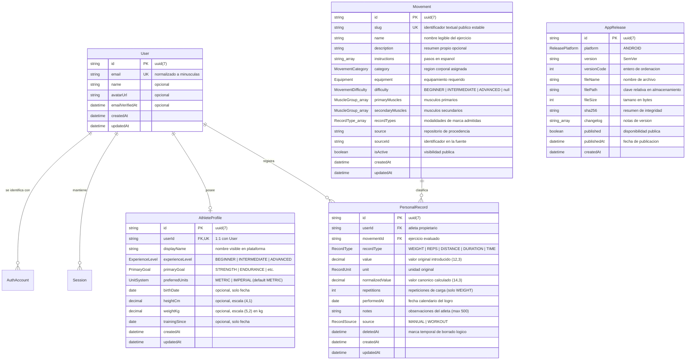

# 7. Modelo de datos

## 7.1 Esquema conceptual y diagrama de entidades

El modelo de persistencia de GarFit se encuentra formalizado en el archivo fuente `apps/api/prisma/schema.prisma`. A partir de dicha especificación se genera de forma determinista el diagrama entidad-relación oficial accesible en [`docs/generated/database/erd.svg`](../generated/database/erd.svg).

En la **fase 2**, el modelo incorpora las entidades fundamentales del dominio deportivo (`Movement` y `PersonalRecord`), expande el perfil del atleta (`AthleteProfile`) con atributos antropométricos y preferencias de unidades, e introduce ocho nuevas enumeraciones tipadas.

## 7.2 Entidades de identidad y sesión

Las entidades de autenticación de la fase 1 se conservan íntegras:

- **`User`:** Representa la identidad del atleta. El atributo `email` cuenta con restricción de unicidad estricta (`@unique`) y se almacena forzosamente en minúsculas. Sus relaciones con perfiles, sesiones, cuentas y marcas configuran eliminación en cascada (`onDelete: Cascade`).
- **`AuthAccount`:** Modela el vínculo de una cuenta con un proveedor de identidad (`LOCAL` o `GOOGLE`). Posee una clave única compuesta `@@unique([provider, providerAccountId])` y `@@unique([userId, provider])`, asegurando que una persona no vincule dos credenciales del mismo tipo ni duplique un identificador externo.
- **`Session`:** Modela las sesiones activas mediante el resumen criptográfico `refreshTokenHash` (SHA-256), con índice `@@index([userId])` para agilizar revocaciones masivas.

## 7.3 Perfil deportivo ampliado (`AthleteProfile`)

La entidad `AthleteProfile` mantiene una relación uno a uno estricta con `User` mediante la clave única `userId`. En la fase 2 se añaden campos antropométricos y preferencias de unidades:

| Atributo | Tipo de dato | Restricciones y valores | Justificación y propósito técnico |
| --- | --- | --- | --- |
| `id` | String | PK, `@default(uuid(7))` | Identificador único del perfil. |
| `userId` | String | FK `@unique`, relación 1:1 con `User` | Asegura que un atleta posea a lo sumo un perfil en el sistema. |
| `displayName` | String | Longitud 1 a 40 caracteres | Nombre con el que el atleta se identifica en la interfaz. |
| `experienceLevel`| Enum | `BEGINNER`, `INTERMEDIATE`, `ADVANCED` | Nivel de experiencia del atleta. |
| `primaryGoal` | Enum | `STRENGTH`, `ENDURANCE`, `HYPERTROPHY`, `WEIGHT_LOSS`, `GENERAL_FITNESS` | Objetivo atlético primordial. |
| `preferredUnits` | Enum | `METRIC`, `IMPERIAL` (por defecto `METRIC`) | Determina el sistema de unidades para proyectar pesos y distancias en la interfaz gráfica. |
| `birthDate` | DateTime? | `@db.Date`, nullable | Fecha de nacimiento para derivar edad cronológica sin almacenar datos clínicos. |
| `heightCm` | Decimal? | `@db.Decimal(4, 1)`, nullable | Altura corporal expresada siempre en centímetros (rango admitido: 50.0 a 272.0 cm). |
| `weightKg` | Decimal? | `@db.Decimal(5, 2)`, nullable | Peso corporal expresado siempre en kilogramos (rango admitido: 20.00 a 400.00 kg). |
| `trainingSince` | DateTime? | `@db.Date`, nullable | Fecha de inicio de actividad física para calcular años de entrenamiento. |
| `createdAt` | DateTime | `@default(now())` | Marca temporal de creación para auditoría. |
| `updatedAt` | DateTime | `@updatedAt` | Marca temporal de última modificación. |

*Reglas de integridad del perfil:*
- Los valores de `heightCm` y `weightKg` se persisten siempre en el sistema métrico (centímetros y kilogramos) independientemente de la preferencia del atleta; los clientes convierten desde pulgadas o libras al enviar la petición.
- Se prohíbe explícitamente el almacenamiento de datos clínicos, lesiones, afecciones cardíacas o historiales médicos, limitando el perfil al contexto puramente deportivo.
- Una actualización vía `PUT /profile` reemplaza el perfil completo; los campos opcionales omitidos regresan a valor `null`.

## 7.4 Catálogo de movimientos (`Movement`)

La entidad `Movement` almacena el catálogo estandarizado de ejercicios corporales:

| Atributo | Tipo de dato | Restricciones | Propósito y justificación |
| --- | --- | --- | --- |
| `id` | String | PK, `@default(uuid(7))` | Identificador interno inmutable. |
| `slug` | String | `@unique`, patrón kebab-case | Identificador legible y estable para URLs amigables (`/movements/barbell-full-squat`). |
| `name` | String | Longitud hasta 120 caracteres | Denominación estandarizada del movimiento. |
| `description` | String? | Nullable | Resumen técnico del movimiento. La fuente no lo provee; se reserva para curaduría manual. |
| `instructions`| String[] | Array de texto no vacío | Pasos secuenciales de ejecución traducidos al español. |
| `category` | Enum | `MovementCategory` (10 valores) | Región anatómica asignada en la taxonomía de origen. |
| `equipment` | Enum | `Equipment` (28 valores) | Tipo de implemento o aparato requerido para la ejecución. |
| `difficulty` | Enum? | `MovementDifficulty`, nullable | Nivel de destreza (`BEGINNER`, `INTERMEDIATE`, `ADVANCED`). Nulo cuando la fuente no lo clasifica. |
| `primaryMuscles` | Enum[] | `MuscleGroup` (mínimo 1) | Músculos primarios directamente estimulados. |
| `secondaryMuscles` | Enum[] | `MuscleGroup` | Músculos estabilizadores o secundarios involucrados. |
| `recordTypes` | Enum[] | `RecordType` (mínimo 1) | Modalidades de marca que tiene sentido evaluar en este ejercicio. |
| `source` | String? | Texto descriptivo | Repositorio de procedencia (`hasaneyldrm/exercises-dataset`). |
| `sourceId` | String? | Identificador original | Identificador asignado en el repositorio de origen (p. ej., `0001`). |
| `isActive` | Boolean | `@default(true)` | Indica si el movimiento está disponible para consulta y registro. |
| `createdAt`, `updatedAt` | DateTime | Auditoría | Fechas de alta y modificación del registro. |

*Justificación de índices y unicidades en `Movement`:*
- `@@unique([slug])`: Garantiza unicidad en las rutas de navegación pública y previene ambigüedades en la siembra.
- `@@unique([source, sourceId])`: Impide duplicar un mismo ejercicio de la fuente externa durante sucesivas ejecuciones de importación.
- `@@index([isActive, name])`: Optimiza la consulta más frecuente del sistema: obtener la lista paginada y ordenada alfabéticamente de ejercicios visibles.
- `@@index([category])` y `@@index([equipment])`: Aceleran significativamente el filtrado por región anatómica y equipamiento en catálogos extensos.

## 7.5 Marcas personales (`PersonalRecord`)

La entidad `PersonalRecord` almacena cada marca deportiva registrada por un atleta:

| Atributo | Tipo de dato | Restricciones | Propósito y justificación |
| --- | --- | --- | --- |
| `id` | String | PK, `@default(uuid(7))` | Identificador único universal del registro. |
| `userId` | String | FK `User`, `onDelete: Cascade` | Atleta propietario de la marca. |
| `movementId` | String | FK `Movement`, `onDelete: Restrict` | Movimiento asociado. Se prohíbe eliminar físicamente un movimiento si tiene marcas. |
| `recordType` | Enum | `RecordType` (5 valores) | Modalidad de medición (`WEIGHT`, `REPS`, `DISTANCE`, `DURATION`, `TIME`). |
| `value` | Decimal | `@db.Decimal(12, 3)` | Magnitud numérica tal como fue ingresada por el atleta en `unit`. |
| `unit` | Enum | `RecordUnit` (7 valores) | Unidad de medida en que se capturó la marca. |
| `normalizedValue` | Decimal | `@db.Decimal(14, 3)` | Valor convertido a la unidad canónica internacional (kg, reps, m, s). |
| `repetitions` | Int? | 1 a 100, obligatorio en `WEIGHT` | Número de repeticiones para las que se levantó la carga (1 para 1RM, 5 para 5RM). |
| `performedAt` | DateTime | `@db.Date` | Fecha de calendario en que el atleta realizó la marca (sin zona horaria ni hora). |
| `notes` | String? | Máximo 500 caracteres | Anotaciones opcionales sobre sensaciones, implementos o contexto. |
| `source` | Enum | `RecordSource`, default `MANUAL` | Procedencia de la marca: `MANUAL` (ingresada por el usuario) o `WORKOUT` (fase 3). |
| `deletedAt` | DateTime? | Nullable | Marca de tiempo de borrado lógico; si no es nula, el registro está retirado. |
| `createdAt`, `updatedAt` | DateTime | Auditoría | Momento exacto de inserción y modificación en el sistema. |

*Justificación de índices y reglas en `PersonalRecord`:*
- `@@index([userId, deletedAt, performedAt])`: Índice compuesto fundamental para la aplicación. Permite que las consultas de marcas activas (`where: { userId, deletedAt: null }`) recuperen los registros ordenados por fecha de realización de manera inmediata, eliminando la necesidad de escaneos secuenciales en tablas grandes.
- `@@index([userId, movementId, recordType])`: Optimiza la recuperación del historial completo de un atleta sobre un ejercicio particular para agrupar en series y calcular progresiones.
- `onDelete: Restrict` en `movementId`: Protege la integridad referencial histórica. Un movimiento del catálogo jamás puede ser borrado físicamente si un atleta ya ha registrado una marca sobre él; únicamente puede pasar a estado inactivo (`isActive = false`).

## 7.6 Enumeraciones del dominio deportivo

## 7.7 Extensión de fase 3: WODs, sesiones y resultados

El ERD generado se consulta en [erd.svg](../generated/database/erd.svg). Las tablas siguientes describen atributos persistidos; sus valores se ajustan a la validación de dominio y no se sustituyen por texto libre.

| Entidad | Atributos relevantes | Propósito |
| --- | --- | --- |
| `Wod` | `slug`, `name`, `workoutType`, `durationSeconds`, `rounds`, `intervalSeconds`, `repScheme`, `isBenchmark`, `source`, `ownerId` | Plantilla pública o privada. |
| `WodExercise` | `wodId`, `movementId`, `position`, `reps`, `loadValue`, `loadUnit`, `distanceValue`, `distanceUnit`, `durationSeconds`, `notes` | Prescripción ordenada del WOD. |
| `Workout` | `userId`, `wodId`, `name`, `workoutType`, `status`, parámetros globales, `performedOn`, `startedAt`, `completedAt`, `deletedAt` | Sesión personal y su ciclo de vida. |
| `WorkoutExercise` | `workoutId`, `movementId`, `position`, objetivos de serie, `restSeconds`, `notes` | Copia o composición de la sesión. |
| `WorkoutResult` | `workoutExerciseId`, `setNumber`, `reps`, carga y kg canónicos, distancia y metros canónicos, `durationSeconds` | Resultado por serie. |
| `WorkoutScore` | `workoutId`, `timeSeconds`, `repsAtTimeCap`, `rounds`, `extraReps`, `completed` | Score global uno a uno. |

`PersonalRecord` añade `distanceValue`, `distanceUnit`, `distanceMeters` y `workoutResultId`. La restricción `@@unique([workoutResultId, recordType])` evita duplicar una marca derivada; los índices por usuario, estado, fecha y movimiento sostienen historial, estadísticas y aislamiento. `WorkoutType` contiene `STRENGTH`, `FOR_TIME`, `AMRAP`, `EMOM`, `CARDIO` y `CUSTOM`; `WorkoutStatus` contiene `DRAFT`, `IN_PROGRESS` y `COMPLETED`.

El esquema define ocho enumeraciones especializadas que delimitan de forma estricta los valores admitidos:

1. **`UnitSystem`:** `METRIC` (sistema métrico: kg, cm, m, km), `IMPERIAL` (sistema imperial: lb, in, mi).
2. **`RecordType`:**
   - `WEIGHT`: Carga levantada (mayor es mejor). Requiere `repetitions`.
   - `REPS`: Cantidad de repeticiones máximas en esfuerzo continuo (mayor es mejor).
   - `DISTANCE`: Distancia total completada (mayor es mejor).
   - `DURATION`: Tiempo sostenido en una postura o esfuerzo isométrico (mayor es mejor).
   - `TIME`: Tiempo empleado en completar una prueba fijada (menor es mejor).
3. **`RecordUnit`:** `KILOGRAM`, `POUND`, `REPETITION`, `METER`, `KILOMETER`, `MILE`, `SECOND`.
4. **`RecordSource`:** `MANUAL` (registrado manualmente por el atleta en la interfaz), `WORKOUT` (generado automáticamente al completar un entrenamiento estructurado en la fase 3).
5. **`MovementCategory` (10 regiones):** `WAIST`, `UPPER_LEGS`, `LOWER_LEGS`, `BACK`, `CHEST`, `SHOULDERS`, `UPPER_ARMS`, `LOWER_ARMS`, `NECK`, `CARDIO`.
6. **`Equipment` (28 categorías):** `BODY_WEIGHT`, `ASSISTED`, `WEIGHTED`, `BARBELL`, `OLYMPIC_BARBELL`, `EZ_BARBELL`, `TRAP_BAR`, `SMITH_MACHINE`, `DUMBBELL`, `KETTLEBELL`, `CABLE`, `LEVERAGE_MACHINE`, `SLED_MACHINE`, `BAND`, `RESISTANCE_BAND`, `MEDICINE_BALL`, `STABILITY_BALL`, `BOSU_BALL`, `ROPE`, `ROLLER`, `WHEEL_ROLLER`, `HAMMER`, `TIRE`, `STATIONARY_BIKE`, `ELLIPTICAL_MACHINE`, `STEPMILL_MACHINE`, `SKIERG_MACHINE`, `UPPER_BODY_ERGOMETER`.
7. **`MuscleGroup` (23 grupos):** `ABS`, `OBLIQUES`, `CORE`, `HIP_FLEXORS`, `LOWER_BACK`, `UPPER_BACK`, `LATS`, `TRAPS`, `NECK`, `CHEST`, `SHOULDERS`, `SERRATUS_ANTERIOR`, `BICEPS`, `TRICEPS`, `FOREARMS`, `GLUTES`, `QUADRICEPS`, `HAMSTRINGS`, `ADDUCTORS`, `ABDUCTORS`, `CALVES`, `ANKLES_AND_FEET`, `CARDIOVASCULAR_SYSTEM`.
8. **`MovementDifficulty`:** `BEGINNER`, `INTERMEDIATE`, `ADVANCED`.

Todas las enumeraciones de Prisma se sincronizan bidireccionalmente con los tipos de TypeScript de `@garfit/domain` y `@garfit/movements`, verificándose mediante la prueba de integración `apps/api/test/shared-enums.spec.ts`.

## 7.8 Persistencia del análisis explicativo (fase 4)

El consentimiento pertenece al usuario porque una explicación de catálogo no requiere perfil deportivo. El campo `aiConsentAt` es nulo mientras no exista consentimiento y conserva la fecha de aceptación; su eliminación al revocar impide nuevos envíos. Los análisis válidos son locales y se eliminan con la cuenta por la relación dependiente.

| Atributo de `AiAnalysis` | Finalidad |
| --- | --- |
| `id`, `userId`, `type` y `targetId` | Identifican propietario, operación y recurso analizado. |
| `periodDays` | Distingue el intervalo de un análisis de progreso. |
| `provider`, `model` y `promptVersion` | Hacen reproducible el contexto tecnológico. |
| `contextHash` | Localiza respuesta equivalente sin nueva llamada externa. |
| `status` y `responseJson` | Conservan salida validada, hechos y resumen usado. |
| `inputTokens`, `outputTokens`, `durationMs` y `createdAt` | Registran telemetría disponible y generación. |

Los enums `AiAnalysisType` distinguen progreso, entrenamiento, explicación de WOD y explicación de movimiento; `AiAnalysisStatus` distingue resultado completado de datos insuficientes. El índice compuesto por usuario, hash, versión de instrucción y modelo sostiene la caché y evita compartir una respuesta entre atletas.

No se persisten clave del proveedor ni prompt completo. La salida se guarda sólo después de validación, junto con hechos calculados; el registro permite auditoría sin convertir secretos o instrucciones completas en datos de aplicación.
