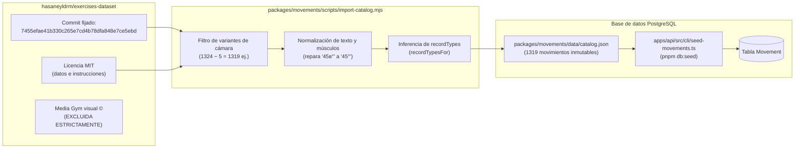

# 8. Implementación

## 8.1 API NestJS (`apps/api`)

La implementación de la fase 2 en el backend extiende la arquitectura modular de NestJS 12 incorporando los módulos especializados en el dominio deportivo, adaptando perfiles y orquestando tareas CLI:

- **Módulo de movimientos (`apps/api/src/movements`):**
  - `movements.controller.ts`: Expone `GET /movements` con el decorador `@UseGuards(JwtAuthGuard)`, admitiendo parámetros de consulta validados mediante `MovementQueryDto`. Expone asimismo `GET /movements/:slug` para la recuperación de fichas individuales.
  - `movements.service.ts`: Construye dinámicamente el objeto `where` de Prisma filtrando por `isActive: true`. Ejecuta búsquedas con el operador `contains` (con modo `insensitive`) sobre el campo `name`, resuelve filtros de enumeraciones directas (`category`, `equipment`, `difficulty`), evalúa la presencia de tipos de marca con el operador de arrays `has` sobre `recordTypes`, y cruza grupos musculares mediante `hasSome` sobre `primaryMuscles` y `secondaryMuscles`.
  - `dto/movement-query.dto.ts`: Define las restricciones de entrada: `search` (máximo 80 caracteres), `category`, `equipment`, `recordType`, `difficulty`, `muscle` y parámetros de paginación (`page` mínimo 1, `limit` entre 1 y 50).
  - `movement.mapper.ts`: Proyecta los campos de base de datos a las interfaces públicas `MovementSummary` y `MovementDetail`.
- **Módulo de marcas personales (`apps/api/src/records`):**
  - `records.controller.ts`: Provee los puntos de acceso para la captura y ciclo de vida de marcas: `POST /records` (creación), `GET /records` (listado paginado del atleta), `GET /records/summary` (resumen global del panel), `GET /records/:movementSlug` (historial por ejercicio), `PATCH /records/:id` (corrección) y `DELETE /records/:id` (retiro lógico).
  - `records.service.ts`: Implementa la lógica transaccional de marcas. En la creación, comprueba la existencia del movimiento, verifica que el `recordType` pertenezca a los permitidos por el ejercicio, valida la presencia de `repetitions` exclusivamente para `WEIGHT`, calcula `normalizedValue = toCanonical(value, unit)` en el servidor y asigna `userId = token.userId`. En la consulta, delega la agrupación cronológica y el cálculo de métricas de progreso en `summarizeAll` de `@garfit/domain`.
  - `dto/create-record.dto.ts` y `dto/update-record.dto.ts`: Aplican validaciones estrictas con `class-validator`: tipos de marca válidos, números positivos con máximo 3 decimales, unidades permitidas y fechas de calendario ISO (`YYYY-MM-DD`). En `PATCH`, se exige que `value` y `unit` se proporcionen de manera simultánea para garantizar que la re-normalización sea exacta.
- **Módulo de perfil deportivo (`apps/api/src/profile`):**
  - `profile.service.ts`: Soporta el perfil deportivo ampliado. Procesa `preferredUnits` (`METRIC` o `IMPERIAL`), fechas de calendario (`birthDate`, `trainingSince`) y medidas corporales (`heightCm`, `weightKg`). La mutación vía `PUT /profile` sustituye el perfil de forma íntegra; los valores no provistos se persisten explícitamente como `null`.
- **Frontera de inteligencia artificial (`apps/api/src/ai`):**
  - `progress-snapshot.service.ts`: Ensambla la estructura `AthleteProgressSnapshot` leyendo el perfil y los registros activos del atleta desde Prisma y aplicando `buildProgressSnapshot` de `@garfit/domain`. Este servicio provee un contexto deportivo inmutable y determinista listo para alimentar al proveedor de Gemini en la fase 3, sin exponer credenciales ni conexiones de base de datos al modelo.
- **Herramientas de línea de comandos (`apps/api/src/cli`):**
  - `seed-movements.ts`: Script de carga del catálogo ejecutable mediante `pnpm db:seed`.
  - `seed-demo.ts`: Inicializador de datos de prueba para demostraciones, ejecutable mediante `pnpm db:seed:demo`.
  - `export-openapi.ts`: Genera la especificación OpenAPI en `docs/generated/openapi/`.

## 8.2 Paquetes compartidos del monorepo

El código de negocio central reside en bibliotecas independientes dentro de `packages/`, garantizando que ninguna regla deportiva dependa de componentes web o de servidor:

- **`@garfit/domain` (`packages/domain/src`):**
  - `rules.ts`: Fuente de verdad de constantes y límites del sistema: `RECORD_TYPES`, `RECORD_UNITS`, `UNITS_BY_RECORD_TYPE`, `RECORD_LIMITS`, `PROFILE_LIMITS` (estatura: 50 a 272 cm; peso: 20 a 400 kg; edad: 5 a 120 años), `SLUG_PATTERN` y directivas de paginación (`PAGINATION`).
  - `units.ts`: Funciones matemáticas de conversión canónica (`toCanonical`, `fromCanonical`) con definiciones internacionales (1 lb = 0.45359237 kg; 1 mi = 1609.344 m). La función `roundTo(value, decimals)` compensa desbordamientos de coma flotante y redondea empates alejándose de cero de manera simétrica (`6.25 -> 6.3` y `-6.25 -> -6.3`). Incluye formateadores unificados de cadenas (`formatRecordValue`, `formatDuration`, `parseDuration`).
  - `records.ts`: Define las estructuras `RecordEntry`, `RecordSeriesSummary` y `Change`. Provee `lowerIsBetter` (donde `TIME` es el único tipo que mejora al descender su valor), `seriesKey` (agrupador por modalidad y repeticiones de carga), `computeChange` (cálculo de variaciones absolutas y porcentuales) y los agregadores deterministas `summarizeSeries` y `summarizeAll`.
  - `dates.ts`: Validador de fechas de calendario sin zona horaria (`isValidIsoDate`), cálculo exacto de edad en años cumplidos (`ageInYears`) y control de fechas futuras (`isNotInFuture`).
  - `progress-snapshot.ts`: Generador del contrato `AthleteProgressSnapshot` mediante `buildProgressSnapshot`.
- **`@garfit/movements` (`packages/movements/src`):**
  - `taxonomy.ts`: Enumeraciones canónicas de regiones corporales (`MOVEMENT_CATEGORIES`), equipamiento deportivo (`EQUIPMENT`), grupos musculares (`MUSCLE_GROUPS`) y sus representaciones textuales amigables en español.
  - `record-types.ts`: Implementa `recordTypesFor`, deduciendo qué métricas corresponden a cada ejercicio según la presencia de carga externa, máquinas de cardio o nombres de isometría (`plank`, `hold`, `hang`, `wall sit`, `l-sit`, `bridge`).
  - `source-transform.ts`: Transforma los datos brutos del dataset en 1319 movimientos normalizados con `slugs` deterministas y seguros.
- **`@garfit/validation` (`packages/validation/src`):**
  - Expone esquemas de Zod reutilizables para clientes (`createRecordSchema`, `updateRecordSchema`, `athleteProfileSchema`, `loginSchema`, `registerSchema`).
- **`@garfit/api-client` (`packages/api-client/src`):**
  - Cliente de consumo HTTP tipado con métodos asíncronos para movimientos (`listMovements`, `getMovement`), marcas (`listRecords`, `getRecordSummary`, `getMovementHistory`, `createRecord`, `updateRecord`, `deleteRecord`) y perfil deportivo (`getProfile`, `updateProfile`).

## 8.3 Aplicación web (`apps/web`)

La aplicación web construida sobre Next.js 16 (`apps/web/src/app/app`) implementa el recorrido de usuario del atleta:

- **Exploración de movimientos (`movements/`):**
  - `movements/page.tsx`: Vista principal del catálogo equipada con campo de búsqueda por texto, controles desplegables para filtrar por equipamiento y categoría anatómica, paginación numérica y renderizado de tarjetas de ejercicio con etiquetas visuales de músculos primarios y tipos de marca admitidos.
  - `movements/[slug]/page.tsx`: Ficha individual del ejercicio que detalla el implemento requerido, listas de músculos primarios y secundarios, la guía paso a paso de ejecución en español y un acceso directo a registrar marca en dicho movimiento.
- **Gestión de marcas personales (`records/`):**
  - `records/page.tsx`: Vista general "Mis marcas", estructurada en tarjetas ordenadas cronológicamente con la mejor marca conseguida, fecha del último logro y enlace directo al historial.
  - `records/new/page.tsx`: Formulario de captura de marca personal; permite buscar el movimiento deseado, autocompleta las unidades según el tipo de marca seleccionado, solicita repeticiones si la marca es de peso y valida la fecha de calendario.
  - `records/[movementSlug]/page.tsx`: Vista de historial deportivo que desglosa las series de marcas del ejercicio (p. ej., serie de 1RM vs. serie de 5RM), muestra la mejor marca histórica con su fecha, el progreso respecto al intento anterior (+X kg) y renderiza la curva de evolución mediante el componente SVG `progress-chart.tsx`.
  - `records/[movementSlug]/[id]/edit/page.tsx`: Pantalla de edición controlada que permite corregir el valor o unidad y ofrece el botón de confirmación para el retiro de la marca mediante borrado lógico.
- **Perfil deportivo (`profile/page.tsx`):**
  - Formulario reactivo para configurar el sistema de unidades (`METRIC` / `IMPERIAL`), altura, peso y fechas clave del atleta. Integra utilidades de conversión (`profile-units.ts`) para proyectar las medidas en pulgadas o libras si el atleta prefiere el sistema imperial, reconvirtiéndolas a centímetros y kilogramos antes de transmitirlas a la API.

## 8.4 Aplicación móvil (`apps/mobile`)

La aplicación nativa desarrollada con Expo SDK 57 (`apps/mobile/src/app/(app)`) ofrece una interfaz adaptada al contexto móvil del atleta:

- **Navegación protegida:** Configurada en `_layout.tsx` mediante `Stack.Protected`, asegurando que ninguna pantalla deportiva sea accesible sin una sesión válida restaurada desde `SecureStore`.
- **Navegación principal por pestañas (`(tabs)/`):**
  - `(tabs)/index.tsx`: Panel principal del atleta que consume `GET /records/summary`, mostrando contadores de marcas activas, movimientos trabajados y accesos directos.
  - `(tabs)/progress.tsx`: Listado consolidado de marcas y progresiones del usuario.
  - `(tabs)/profile.tsx`: Gestión del perfil del atleta, visualización de experiencia y selector del sistema de unidades preferido.
- **Rutas de catálogo y marcas:**
  - `movements/index.tsx` y `movements/[slug].tsx`: Explorador nativo de ejercicios y ficha técnica con instrucciones táctiles.
  - `records/new.tsx`: Formulario nativo optimizado con selectores de fecha y campos numéricos adaptados al teclado móvil.
  - `records/[movementSlug].tsx`: Historial cronológico móvil del ejercicio.

## 8.5 Importación del catálogo y siembra de datos

Para garantizar la reproducibilidad y legitimidad jurídica del catálogo de movimientos, el sistema implementa una canalización de datos rigurosa:

1. **Atribución de origen y exclusión de multimedia:** El catálogo se extrae del repositorio público `hasaneyldrm/exercises-dataset` (commit inmutable `7455efae41b330c265e7cd4b78dfa848e7ce5ebd`), cuyos metadatos e instrucciones en español se encuentran bajo licencia MIT. Las imágenes y videos originales pertenecen comercialmente a *Gym visual ©*; GarFit no descarga, no referencia ni distribuye ningún activo multimedia protegido (ver [`packages/movements/data/THIRD_PARTY_NOTICE.md`](packages/movements/data/THIRD_PARTY_NOTICE.md)).
2. **Transformación estandarizada (`source-transform.ts`):** Descarta 5 variantes superfluas de ángulo de cámara (`(side pov)`, `(back pov)`), corrigiendo 1324 ejercicios a un total limpio de 1319 movimientos. Repara fallos de codificación de caracteres, desambigua nombres duplicados añadiendo sufijos identificadores, unifica sinónimos musculares en 23 grupos anatómicos normalizados y deriva los tipos de marca admitidos.
3. **Semilla oficial del catálogo (`pnpm db:seed`):** Ejecuta `seed-movements.ts` en lotes transaccionales de 200 registros. Realiza operaciones `upsert` basadas en la clave única `slug`. En caso de que un movimiento previamente existente ya no figure en el catálogo, se actualiza a `isActive: false`, garantizando que jamás se elimine físicamente un movimiento que posea marcas personales vinculadas. Su ejecución es estrictamente idempotente: una segunda corrida toma ~6 segundos y resulta en 0 registros creados y 1319 actualizados.
4. **Semilla de demostración (`pnpm db:seed:demo`):** Ejecuta `seed-demo.ts` para pruebas manuales y presentaciones académicas. Requiere que la variable `DEMO_USER_PASSWORD` se encuentre definida con un mínimo de 8 caracteres y aborta la ejecución si `NODE_ENV === 'production'`. Crea el usuario `demo@garfit.example` con contraseña segura, perfil intermedio y 8 marcas históricas distribuidas cronológicamente en sentadilla con barra (100, 105 y 110 kg), press de banca (75 y 80 kg), flexiones de pecho (30 y 38 repeticiones) y plancha abdominal (60 segundos).

## 8.6 Entorno de ejecución y scripts de desarrollo

El proyecto emplea scripts de orquestación centralizados en la raíz del monorepo mediante Turborepo y pnpm:

- `pnpm dev`: Inicia concurrentemente los servidores de desarrollo de la API NestJS (puerto 4000), la aplicación web Next.js (puerto 3000) y la landing page Astro (puerto 4321), manteniendo los paquetes compartidos en modo de observación continua (`watch`).
- `pnpm dev:mobile`: Inicia el empaquetador Metro de Expo para la aplicación móvil en el puerto 8081. Este script se separa deliberadamente de `pnpm dev` debido a que el CLI de Expo demanda una terminal interactiva para el escaneo de códigos QR y selección de emuladores.
- `pnpm dev:api`, `pnpm dev:web`, `pnpm dev:landing`: Scripts granulares para levantar servicios individuales cuando se requiere aislar el consumo de recursos de cómputo.
- *Comportamiento de Astro 7 en landing:* El servidor de desarrollo de Astro 7 detecta automáticamente si la sesión de ejecución proviene de un entorno no interactivo o agente de inteligencia artificial, ejecutándose de forma desatendida en segundo plano; en una consola humana tradicional, permanece en primer plano proporcionando atajos de teclado interactivos.
