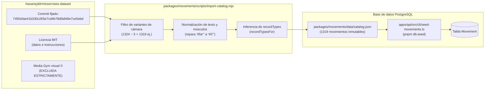

# 8. Implementación

## 8.1 API NestJS (`apps/api`)

La implementación de la fase 2 en el backend extiende la arquitectura modular de NestJS 12 incorporando los módulos especializados en el dominio deportivo, adaptando perfiles y orquestando tareas CLI:

- **Módulo de movimientos (`apps/api/src/movements`):**
  - `movements.controller.ts`: Expone `GET /movements` con el decorador `@UseGuards(JwtAuthGuard)`, admitiendo parámetros de consulta validados. Expone asimismo `GET /movements/:slug` para la recuperación de fichas individuales.
  - `movements.service.ts`: Construye dinámicamente el objeto `where` de Prisma filtrando por `isActive: true`. Ejecuta búsquedas por `name`, resuelve filtros directos de `category`, `equipment` y `difficulty`, evalúa tipos admitidos en `recordTypes` y grupos musculares primarios o secundarios.
  - `dto/movement-query.dto.ts`: Define las restricciones de entrada: `search` (máximo 80 caracteres), `category`, `equipment`, `recordType`, `difficulty`, `muscle` y parámetros de paginación (`page` mínimo 1, `limit` entre 1 y 50).
  - `movement.mapper.ts`: Proyecta los campos de base de datos a las interfaces públicas `MovementSummary` y `MovementDetail`.
- **Módulo de marcas personales (`apps/api/src/records`):**
  - `records.controller.ts`: Provee los puntos de acceso para la captura y ciclo de vida de marcas: `POST /records` (creación), `GET /records` (listado paginado del atleta), `GET /records/summary` (resumen global del panel), `GET /records/:movementSlug` (historial por ejercicio), `PATCH /records/:id` (corrección) y `DELETE /records/:id` (retiro lógico).
  - `records.service.ts`: Implementa la lógica transaccional de marcas. En la creación, comprueba la existencia del movimiento, verifica que el `recordType` pertenezca a los permitidos por el ejercicio, valida la presencia de `repetitions` exclusivamente para `WEIGHT`, calcula `normalizedValue = toCanonical(value, unit)` en el servidor y asigna `userId = token.userId`. En la consulta, delega la agrupación cronológica y el cálculo de métricas de progreso en `summarizeAll` de `@garfit/domain`.
  - `dto/create-record.dto.ts` y `dto/update-record.dto.ts`: Aplican validaciones estrictas con `class-validator`: tipos de marca válidos, números positivos con máximo 3 decimales, unidades permitidas y fechas de calendario ISO (`YYYY-MM-DD`). En `PATCH`, se exige que `value` y `unit` se proporcionen de manera simultánea para garantizar que la re-normalización sea exacta.
- **Módulo de perfil deportivo (`apps/api/src/profile`):**
  - `profile.service.ts`: Soporta el perfil deportivo ampliado. Procesa `preferredUnits` (`METRIC` o `IMPERIAL`), fechas de calendario (`birthDate`, `trainingSince`) y medidas corporales (`heightCm`, `weightKg`). La mutación vía `PUT /profile` sustituye el perfil de forma íntegra; los valores no provistos se persisten explícitamente como `null`.
- **Frontera de inteligencia artificial (`apps/api/src/ai`):**
  - `progress-snapshot.service.ts`: Ensambla la estructura `AthleteProgressSnapshot` leyendo el perfil y los registros activos del atleta desde Prisma y aplicando `buildProgressSnapshot` de `@garfit/domain`. Este servicio provee un contexto deportivo inmutable y determinista listo para alimentar al proveedor de Gemini en la fase 3, sin exponer credenciales ni conexiones de base de datos al modelo.
- **Herramientas de línea de comandos (`apps/api/src/cli`):**
  - `seed-movements.ts`: Script de carga del catálogo ejecutable mediante `pnpm db:seed`.
  - `seed-demo.ts`: Inicializador de datos de prueba para demostraciones, ejecutable mediante `pnpm db:seed:demo`.
  - `export-openapi.ts`: Genera la especificación OpenAPI en `docs/generated/openapi/`.

## 8.2 Paquetes compartidos del monorepo

El código de negocio central reside en bibliotecas independientes dentro de `packages/`, garantizando que ninguna regla deportiva dependa de componentes web o de servidor:

- **`@garfit/domain` (`packages/domain/src`):**
  - `rules.ts`: Fuente de verdad de constantes y límites del sistema: `RECORD_TYPES`, `RECORD_UNITS`, `UNITS_BY_RECORD_TYPE`, `RECORD_LIMITS`, `PROFILE_LIMITS` (estatura: 50 a 272 cm; peso: 20 a 400 kg; edad: 5 a 120 años), `SLUG_PATTERN` y directivas de paginación (`PAGINATION`).
  - `units.ts`: Funciones matemáticas de conversión canónica (`toCanonical`, `fromCanonical`) con definiciones internacionales (1 lb = 0.45359237 kg; 1 mi = 1609.344 m). La función `roundTo(value, decimals)` compensa desbordamientos de coma flotante y redondea empates alejándose de cero de manera simétrica (`6.25 -> 6.3` y `-6.25 -> -6.3`). Incluye formateadores unificados de cadenas (`formatRecordValue`, `formatDuration`, `parseDuration`).
  - `records.ts`: Define las estructuras `RecordEntry`, `RecordSeriesSummary` y `Change`. Provee `lowerIsBetter` (donde `TIME` es el único tipo que mejora al descender su valor), `seriesKey` (agrupador por modalidad y repeticiones de carga), `computeChange` (cálculo de variaciones absolutas y porcentuales) y los agregadores deterministas `summarizeSeries` y `summarizeAll`.
  - `dates.ts`: Validador de fechas de calendario sin zona horaria (`isValidIsoDate`), cálculo exacto de edad en años cumplidos (`ageInYears`) y control de fechas futuras (`isNotInFuture`).
  - `progress-snapshot.ts`: Generador del contrato `AthleteProgressSnapshot` mediante `buildProgressSnapshot`.
- **`@garfit/movements` (`packages/movements/src`):**
  - `taxonomy.ts`: Enumeraciones canónicas de regiones corporales (`MOVEMENT_CATEGORIES`), equipamiento deportivo (`EQUIPMENT`), grupos musculares (`MUSCLE_GROUPS`) y sus representaciones textuales amigables en español.
  - `record-types.ts`: Implementa `recordTypesFor`, deduciendo qué métricas corresponden a cada ejercicio según la presencia de carga externa, máquinas de cardio o nombres de isometría (`plank`, `hold`, `hang`, `wall sit`, `l-sit`, `bridge`).
  - `source-transform.ts`: Transforma los datos brutos del dataset en 1319 movimientos normalizados con `slugs` deterministas y seguros.
- **`@garfit/validation` (`packages/validation/src`):**
  - Expone esquemas de Zod reutilizables para clientes (`createRecordSchema`, `updateRecordSchema`, `athleteProfileSchema`, `loginSchema`, `registerSchema`).
- **`@garfit/api-client` (`packages/api-client/src`):**
  - Cliente de consumo HTTP tipado con métodos asíncronos para movimientos, marcas (`list`, `summary`, `forMovement`, `create`, `update`, `remove`) y perfil deportivo (`ProfileService.get`, `ProfileService.upsert`).

## 8.3 Aplicación web (`apps/web`)

La aplicación web construida sobre Next.js 16 (`apps/web/src/app/app`) implementa el recorrido de usuario del atleta:

- **Exploración de movimientos (`movements/`):**
  - `movements/page.tsx`: Vista principal del catálogo equipada con campo de búsqueda por texto, controles desplegables para filtrar por equipamiento y categoría anatómica, paginación numérica y renderizado de tarjetas de ejercicio con etiquetas visuales de músculos primarios y tipos de marca admitidos.
  - `movements/[slug]/page.tsx`: Ficha individual del ejercicio que detalla el implemento requerido, listas de músculos primarios y secundarios, la guía paso a paso de ejecución en español y un acceso directo a registrar marca en dicho movimiento.
- **Gestión de marcas personales (`records/`):**
  - `records/page.tsx`: Vista general "Mis marcas", estructurada en tarjetas ordenadas cronológicamente con la mejor marca conseguida, fecha del último logro y enlace directo al historial.
  - `records/new/page.tsx`: Formulario de captura de marca personal; permite buscar el movimiento deseado, autocompleta las unidades según el tipo de marca seleccionado, solicita repeticiones si la marca es de peso y valida la fecha de calendario.
  - `records/[movementSlug]/page.tsx`: Vista de historial deportivo que desglosa las series de marcas del ejercicio (p. ej., serie de 1RM vs. serie de 5RM), muestra la mejor marca histórica con su fecha, el progreso respecto al intento anterior (+X kg) y renderiza la curva de evolución mediante el componente SVG `progress-chart.tsx`.
  - `records/[movementSlug]/[id]/edit/page.tsx`: Pantalla de edición controlada que permite corregir el valor o unidad y ofrece el botón de confirmación para el retiro de la marca mediante borrado lógico.
- **Perfil deportivo (`profile/page.tsx`):**
  - Formulario reactivo para configurar el sistema de unidades (`METRIC` / `IMPERIAL`), altura, peso y fechas clave del atleta. Integra utilidades de conversión (`profile-units.ts`) para proyectar las medidas en pulgadas o libras si el atleta prefiere el sistema imperial, reconvirtiéndolas a centímetros y kilogramos antes de transmitirlas a la API.

## 8.4 Aplicación móvil (`apps/mobile`)

La aplicación nativa desarrollada con Expo SDK 57 (`apps/mobile/src/app/(app)`) ofrece una interfaz adaptada al contexto móvil del atleta:

- **Navegación protegida:** Configurada en `_layout.tsx` mediante `Stack.Protected`, asegurando que ninguna pantalla deportiva sea accesible sin una sesión válida restaurada desde `SecureStore`.
- **Navegación principal por pestañas (`(tabs)/`):**
  - `(tabs)/index.tsx`: Panel principal del atleta que consume `GET /records/summary`, mostrando contadores de marcas activas, movimientos trabajados y accesos directos.
  - `(tabs)/progress.tsx`: Listado consolidado de marcas y progresiones del usuario.
  - `(tabs)/profile.tsx`: Gestión del perfil del atleta, visualización de experiencia y selector del sistema de unidades preferido.
- **Rutas de catálogo y marcas:**
  - `movements/index.tsx` y `movements/[slug].tsx`: Explorador nativo de ejercicios y ficha técnica con instrucciones táctiles.
  - `records/new.tsx`: Formulario nativo optimizado con selectores de fecha y campos numéricos adaptados al teclado móvil.
  - `records/[movementSlug].tsx`: Historial cronológico móvil del ejercicio.

## 8.5 Importación del catálogo y siembra de datos

Para garantizar la reproducibilidad y legitimidad jurídica del catálogo de movimientos, el sistema implementa una canalización de datos rigurosa:

1. **Atribución de origen y exclusión de multimedia:** El catálogo se extrae del repositorio público `hasaneyldrm/exercises-dataset` (commit inmutable `7455efae41b330c265e7cd4b78dfa848e7ce5ebd`), cuyos metadatos e instrucciones en español se encuentran bajo licencia MIT. Las imágenes y videos originales pertenecen comercialmente a *Gym visual ©*; GarFit no descarga, no referencia ni distribuye ningún activo multimedia protegido (ver [`packages/movements/data/THIRD_PARTY_NOTICE.md`](packages/movements/data/THIRD_PARTY_NOTICE.md)).
2. **Transformación estandarizada (`source-transform.ts`):** Descarta 5 variantes superfluas de ángulo de cámara (`(side pov)`, `(back pov)`), corrigiendo 1324 ejercicios a un total limpio de 1319 movimientos. Repara fallos de codificación de caracteres, desambigua nombres duplicados añadiendo sufijos identificadores, unifica sinónimos musculares en 23 grupos anatómicos normalizados y deriva los tipos de marca admitidos.
3. **Semilla oficial del catálogo (`pnpm db:seed`):** Ejecuta `seed-movements.ts` en lotes transaccionales de 200 registros. Realiza operaciones `upsert` basadas en la clave única `slug`. En caso de que un movimiento previamente existente ya no figure en el catálogo, se actualiza a `isActive: false`, garantizando que jamás se elimine físicamente un movimiento que posea marcas personales vinculadas. Su ejecución es estrictamente idempotente: una segunda corrida toma ~6 segundos y resulta en 0 registros creados y 1319 actualizados.
4. **Semilla de demostración (`pnpm db:seed:demo`):** Ejecuta `seed-demo.ts` para pruebas manuales y presentaciones académicas. Requiere que la variable `DEMO_USER_PASSWORD` se encuentre definida con un mínimo de 8 caracteres y aborta la ejecución si `NODE_ENV === 'production'`. Crea el usuario `demo@garfit.example` con contraseña segura, perfil intermedio y 8 marcas históricas distribuidas cronológicamente en sentadilla con barra (100, 105 y 110 kg), press de banca (75 y 80 kg), flexiones de pecho (30 y 38 repeticiones) y plancha abdominal (60 segundos).

## 8.6 Entorno de ejecución y scripts de desarrollo

## 8.7 Implementación de la fase 3

El núcleo está en `packages/domain/src/workouts.ts`: valida prescripciones y resultados, normaliza unidades, calcula volumen y score, deriva candidatos y selecciona mejoras estrictas. `records.ts` incorpora el calificador `distanceMeters` a las series `TIME`; `progress-snapshot.ts` resume entrenamientos, volumen y tendencias sin utilizar IA.

La API implementa rutas y servicios en `apps/api/src/workouts/workouts.controller.ts`, `workouts.service.ts`, `workouts.mapper.ts` y `dto/workout.dto.ts`; los WODs están en `apps/api/src/wods/`. La finalización se protege mediante transacción, bloqueo asesor por `userId` y transición condicional. `apps/api/src/records/records.service.ts` expone el origen y rechaza operar una marca gestionada por entrenamiento.

La web utiliza `apps/web/src/app/app/workouts/` para listado, constructor, detalle y edición, y `apps/web/src/app/app/wods/` para consulta de plantillas. En móvil, `apps/mobile/src/app/(app)/workouts/`, `wods/` y las pestañas `train.tsx`, `history.tsx` e `index.tsx` consumen los mismos contratos. La semilla incorpora 1319 movimientos del dataset, siete curados de origen `garfit` y seis benchmarks: fran, grace, helen, diane, karen y cindy.

A continuación se detalla la implementación técnica de la fase 3 por cada componente del monorepo:

### 8.7.1 Lógica de negocio y reglas deportivas (`packages/domain`)

El paquete `@garfit/domain` concentra las reglas puras e inmutables del dominio deportivo, garantizando que los cálculos sean deterministas y no dependan de la base de datos ni de interfaces de usuario:

- **Módulo de entrenamientos (`packages/domain/src/workouts.ts`):**
  - `validatePrescription(workoutType, prescription)`: Verifica la validez de los parámetros globales de programación (`durationSeconds`, `rounds`, `intervalSeconds`, `repScheme`). Aplica las restricciones de `WORKOUT_LIMITS` y las directivas por tipo: exige duración en `AMRAP`; exige duración e intervalo múltiplo en `EMOM`; admite corte o esquema en `FOR_TIME`; y prohíbe parámetros globales en `STRENGTH` y `CARDIO`.
  - `normalizeSet(set)`: Convierte los valores de una serie realizada a unidades canónicas internacionales (`loadKg`, `distanceMeters`, `durationSeconds`) mediante `toCanonical`. Comprueba la coexistencia obligatoria de valor y unidad para cargas y distancias, valida que las repeticiones sean enteros dentro de los límites y rechaza series que carezcan por completo de métricas.
  - `setVolumeKg(set)` y `totalVolumeKg(sets)`: Computan el volumen acumulado (repeticiones × carga en kg). El cálculo opera de forma exacta serie a serie y redondea a 3 decimales (`roundTo`). Lanza una excepción `RangeError` si recibe valores negativos o `NaN`.
  - `validateScore(workoutType, score)`: Valida el resultado global de la sesión. En `FOR_TIME` exige tiempo o repeticiones al corte de forma mutuamente excluyente; en `AMRAP` exige rondas completadas; en `EMOM` exige el indicador booleano de intervalos completados (`completed`); y en las modalidades basadas en series (`STRENGTH`, `CARDIO`, `CUSTOM`) prohíbe la presencia de score global.
  - `formatScore(workoutType, score)`: Genera la representación textual estandarizada del score ("13:42", "Límite · 142 reps", "8 rondas + 7 reps", "Completado" / "No completado").
  - `summarizeSets(workoutType, sets)`: Extrae el resumen principal de una sesión basada en series: volumen acumulado para fuerza (`Volumen 500 kg`) o el esfuerzo mayor de distancia y tiempo en cardio (`5 km · 23:40`).
  - `recordCandidates(workoutType, exercises)`: Analiza las series de entrenamientos de tipo `STRENGTH` o `CARDIO` para deducir potenciales marcas personales (peso con repeticiones, repeticiones corporales, duración isométrica, distancia o tiempo cronometrado por distancia), filtrando estrictamente por los tipos admitidos por el ejercicio (`Movement.recordTypes`).
  - `candidateKey(entry)`: Construye la clave determinista de agrupación (`movementId|seriesKey`), discriminando marcas de fuerza por número de repeticiones (1RM frente a 5RM) o marcas de cardio por distancia cronometrada (5k frente a 10k).
  - `selectNewRecords(candidates, history)`: Cruza los candidatos contra el historial del atleta seleccionando únicamente las mejoras estrictas (`isBetter`), devolviendo además la mejor marca previa (`previousBest`) para proyectar el incremento.
  - `countInLastDays(dates, days, now)` y `countPerWeek(dates, weeks, now)`: Funciones puras de agregación cronológica para contabilizar sesiones en ventanas móviles de 7 y 30 días y secuencias semanales para el panel de control.
- **Módulo de marcas (`packages/domain/src/records.ts`):** Incorpora el calificador `distanceMeters` a la clave de serie `seriesKey` para marcas de tipo `TIME` (`requiresDistanceQualifier`), permitiendo que un récord de tiempo en 5 km y otro en 10 km coexistan en series independientes.
- **Instantánea de progreso (`packages/domain/src/progress-snapshot.ts`):** Consolida el historial y perfil del atleta en estructuras deterministas listas para auditoría, resumiendo volumen y tendencias sin interactuar con modelos de IA.

### 8.7.2 Catálogo curado y plantillas de referencia (`packages/movements`)

El paquete `@garfit/movements` provee la taxonomía deportiva y enriquece el catálogo con ejercicios y rutinas estándar:

- **Movimientos curados (`packages/movements/src/curated.ts`):** Define con la constante `CURATED_SOURCE = 'garfit'` 7 movimientos fundamentales que no formaban parte del dataset original: `rowing-ergometer`, `air-squat`, `wall-ball`, `box-jump`, `double-under`, `toes-to-bar` y `barbell-clean-and-jerk`. Cada movimiento especifica su categoría anatómica, equipamiento, grupos musculares primarios y secundarios, e instrucciones de ejecución originales en español. La función `curatedMovements` deriva sus `recordTypes` automáticamente mediante `recordTypesFor`.
- **WODs benchmark (`packages/movements/src/benchmark-wods.ts`):** Especifica con `BENCHMARK_SOURCE = 'garfit-benchmarks'` 6 plantillas de entrenamiento funcional de uso común: `fran`, `grace`, `helen`, `diane`, `karen` y `cindy`. Define para cada una el tipo de entrenamiento, esquema de repeticiones, rondas programadas y la colección estructurada de ejercicios con sus cargas oficiales publicadas.

### 8.7.3 Esquemas de validación y cliente HTTP (`@garfit/validation` y `@garfit/api-client`)

- **Contratos Zod (`packages/validation/src/index.ts`):**
  - `createWorkoutSchema`: Unión discriminada estricta que admite creación libre (requiere `name`, `workoutType`, `exercises` y valida la prescripción con `checkPrescription`) o creación a partir de WOD (requiere `wodSlug` y admite `name` alternativo).
  - `updateWorkoutSchema`: Controla la modificación de borradores en estado `DRAFT`, permitiendo actualizar nombre, descripción, notas o la lista completa de ejercicios prescritos.
  - `workoutExerciseInputSchema`: Valida los ejercicios prescritos, exigiendo la correspondencia estricta entre valor y unidad mediante la función auxiliar `pairIssue`.
  - `workoutSetInputSchema`: Valida individualmente cada serie ejecutada delegando en `normalizeSet`.
  - `workoutScoreInputSchema`: Valida la estructura y rangos de las métricas de score global.
  - `workoutResultsSchema`: Valida el conjunto de resultados ejecutados, verificando que no existan ejercicios duplicados ni series con identificador `setNumber` repetido en un mismo ejercicio, y limitando a 300 el total de series por sesión.
  - `completeWorkoutSchema`: Valida el payload de finalización (`performedOn` y objeto opcional `results`).
  - `workoutFiltersSchema` y `wodFiltersSchema`: Validan parámetros de consulta para listados paginados.
- **Cliente HTTP (`packages/api-client/src/index.ts`):**
  - Métodos del espacio de nombres `workouts`: `list(filters)`, `stats()`, `get(id)`, `create(input)`, `update(id, input)`, `remove(id)`, `start(id)`, `saveResults(id, input)` y `complete(id, input)`.
  - Métodos del espacio de nombres `wods`: `list(filters)`, `get(slug)` y `create(input)`.
  - Gestión tipada de excepciones a través de `ApiError`, preservando códigos funcionales estables (`WORKOUT_INCOMPLETE`, `WORKOUT_INVALID_STATE`, `RECORD_MANAGED_BY_WORKOUT`, `WOD_NOT_FOUND`).

### 8.7.4 Módulos de la API NestJS y persistencia transaccional (`apps/api`)

- **Controladores y rutas:**
  - `WorkoutsController` (`apps/api/src/workouts/workouts.controller.ts`):
    - `GET /workouts`: Consulta paginada filtrada por modalidad, estado, ejercicio y fechas.
    - `GET /workouts/stats`: Estadísticas de volumen y frecuencia para el panel de control.
    - `POST /workouts`: Creación de un entrenamiento libre o derivado de un WOD.
    - `GET /workouts/:id`: Recuperación de la ficha técnica con series ejecutadas y marcas derivadas.
    - `PATCH /workouts/:id`: Modificación de datos o ejercicios de un borrador.
    - `DELETE /workouts/:id`: Borrado lógico que responde con código HTTP 204.
    - `POST /workouts/:id/start`: Inicio de la sesión y registro de `startedAt`.
    - `PUT /workouts/:id/results`: Guardado intermedio de series y score.
    - `POST /workouts/:id/complete`: Finalización de la sesión y cálculo de marcas personales.
  - `WodsController` (`apps/api/src/wods/wods.controller.ts`):
    - `GET /wods`: Listado consolidado de benchmarks públicos y plantillas personales.
    - `GET /wods/:slug`: Detalle de prescripción de un WOD.
    - `POST /wods`: Creación de un WOD personal del usuario.
- **Algoritmo de finalización (`complete`) paso a paso (`WorkoutsService.complete`):**
  1. *Transacción interactiva:* La operación completa se ejecuta dentro de un bloque `this.prisma.$transaction(async (tx) => ...)`.
  2. *Bloqueo asesor exclusivo por atleta:* Se invoca `tx.$executeRaw` ejecutando `SELECT pg_advisory_xact_lock(hashtext(${userId}))`. Este candado a nivel de transacción en PostgreSQL serializa todas las finalizaciones concurrentes del mismo atleta, evitando condiciones de carrera en el cómputo de récords.
  3. *Evaluación de idempotencia:* Se consulta el estado del entrenamiento; si `workout.status === 'COMPLETED'`, la transacción retorna de inmediato el registro sin duplicar operaciones ni generar nuevas marcas.
  4. *Reemplazo atómico de series y score:* Si la petición incluye `dto.results`, se ejecuta `replaceResults(tx, workout, dto.results)`, purgando resultados previos (`tx.workoutResult.deleteMany`) e insertando las series normalizadas y el score (`tx.workoutScore.upsert`).
  5. *Comprobación de completitud obligatoria:* Se evalúa `workoutIncompleteDetails(current)`. Si la sesión de fuerza no tiene series con repeticiones, o la de cardio carece de distancia/duración, o el score de `FOR_TIME`, `AMRAP` o `EMOM` incumple `validateScore`, se cancela la transacción lanzando `ApiException(422, 'WORKOUT_INCOMPLETE', ...)`.
  6. *Transición condicional:* Se actualiza el entrenamiento mediante `tx.workout.updateMany({ where: { id, userId, deletedAt: null, status: { not: 'COMPLETED' } }, data: { status: 'COMPLETED', completedAt: new Date(), performedOn } })`.
  7. *Derivación y persistencia de marcas:* Si `transition.count > 0`, se invoca `createRecords(tx, userId, id)`. Se calculan los candidatos con `recordCandidates`, se obtienen las mejores marcas históricas activas del atleta, se filtran con `selectNewRecords` y se insertan las nuevas filas en `PersonalRecord` con `source: 'WORKOUT'` y `workoutResultId` enlazado a la serie generadora.
- **Borrado lógico y retiro de marcas (`WorkoutsService.remove`):**
  - La operación de borrado se ejecuta en una transacción atómica que actualiza `deletedAt = new Date()` en la tabla `Workout` y, de forma coordinada, en todos los `PersonalRecord` que apunten a resultados de dicho entrenamiento (`workoutResult: { workoutExercise: { workoutId: id } }`), retirando las marcas de todos los cálculos sin perder trazabilidad.

### 8.7.5 Protección de marcas personales derivadas (`apps/api/src/records`)

Para preservar la veracidad del historial deportivo y evitar discrepancias entre una marca y la sesión que la generó:

- **Bloqueo de mutación directa (`RECORD_MANAGED_BY_WORKOUT`):**
  - En `RecordsService.findOwnedRecord`, si el registro recuperado posee `record.source === 'WORKOUT'`, el servidor interrumpe la petición lanzando `ApiException(409, 'RECORD_MANAGED_BY_WORKOUT', 'Esta marca proviene de un entrenamiento: gestiónala desde el entrenamiento')`.
  - Este candado aplica de manera simétrica ante `PATCH /records/:id` y `DELETE /records/:id`. La única vía para modificar o anular una marca derivada consiste en rectificar o eliminar el entrenamiento que la originó.
- **Trazabilidad de origen:** El mapper `toPersonalRecord` incluye el objeto `origin` (`workoutId`, `workoutName`, `performedOn`, `setNumber`, `reps`), informando al cliente sobre la procedencia exacta de la marca.

### 8.7.6 Aplicación web y Server Actions (`apps/web`)

- **Rutas de la interfaz web (`apps/web/src/app/app`):**
  - `workouts/page.tsx`: Listado con pestañas de "Pendientes" e "Historial" y filtros por tipo, estado y fecha.
  - `workouts/new/page.tsx`: Vista del constructor de sesiones sustentada en `WorkoutBuilder`.
  - `workouts/[id]/page.tsx`: Pantalla interactiva que despliega el estado activo o la vista completada (`Completed`) con cálculo de volumen, score y marcas personales logradas.
  - `workouts/[id]/edit/page.tsx`: Formulario de edición reservado exclusivamente a borradores.
  - `wods/page.tsx` y `wods/[slug]/page.tsx`: Explorador de WODs con catálogo de benchmarks y botón "Usar este WOD".
- **Server Actions (`apps/web/src/app/workout-actions.ts`):**
  - Funciones asíncronas de servidor: `createWorkout`, `updateWorkout`, `startWorkout`, `saveWorkoutResults`, `completeWorkout`, `removeWorkout` y `useWod`.
  - *Manejo de `redirect()` fuera de bloques try/catch:* En el modelo de servidor de Next.js, la función `redirect()` opera lanzando internamente un error de control denominado `NEXT_REDIRECT`. Si la invocación a `redirect()` se sitúa dentro de un bloque `try/catch`, la excepción es capturada indebidamente como un fallo genérico, frustrando la navegación del usuario. Por esta razón técnica, todas las invocaciones a `redirect()` en las acciones de entrenamiento se ubican estrictamente después y fuera de los bloques de captura de errores de la API.

### 8.7.7 Aplicación móvil (`apps/mobile`)

La aplicación nativa en Expo SDK 57 (`apps/mobile/src/app/(app)`) adapta el flujo deportivo al entorno móvil:

- **Pestaña Entrenar (`(tabs)/train.tsx`):** Provee accesos a "Nuevo entrenamiento" y "Desde un WOD", además de listar borradores y entrenamientos en curso en "Continúa donde lo dejaste".
- **Pestaña Historial (`(tabs)/history.tsx`):** Renderiza sesiones completadas agrupadas cronológicamente con `groupWorkouts` sobre un componente `FlatList` con soporte de paginación infinita.
- **Pestaña Inicio (`(tabs)/index.tsx`):** Integra el componente `WorkoutSummary` para exponer el conteo semanal y mensual de entrenamientos, marcas de los últimos 30 días y enlace directo al último entrenamiento.
- **Pantallas operativas:** `workouts/new.tsx` (constructor táctil con selectores de tipo `Choice`), `workouts/[id].tsx` (ejecución con registro dinámico de series y selector interactivo de score) y `wods/index.tsx` / `wods/[slug].tsx` (catálogo y clonación de WODs).

### 8.7.8 Semillas e inicialización de datos (`apps/api/src/cli`)

- **`seed-movements.ts` (`pnpm db:seed`):** Carga idempotente en lotes de 200 registros que inicializa los 1319 movimientos del catálogo, los 7 movimientos curados y los 6 WODs benchmark de referencia.
- **`seed-demo.ts` (`pnpm db:seed:demo`):** Genera el atleta de demostración `demo@garfit.example` con 5 marcas manuales y 3 entrenamientos cerrados ejecutados mediante instancias directas de `WorkoutsService`, verificando la derivación de marcas en fuerza y carrera de resistencia.

El proyecto emplea scripts de orquestación centralizados en la raíz del monorepo mediante Turborepo y pnpm:

- `pnpm dev`: Inicia concurrentemente los servidores de desarrollo de la API NestJS (puerto 4000), la aplicación web Next.js (puerto 3000) y la landing page Astro (puerto 4321), manteniendo los paquetes compartidos en modo de observación continua (`watch`).
- `pnpm dev:mobile`: Inicia el empaquetador Metro de Expo para la aplicación móvil en el puerto 8081. Este script se separa deliberadamente de `pnpm dev` debido a que el CLI de Expo demanda una terminal interactiva para el escaneo de códigos QR y selección de emuladores.
- `pnpm dev:api`, `pnpm dev:web`, `pnpm dev:landing`: Scripts granulares para levantar servicios individuales cuando se requiere aislar el consumo de recursos de cómputo.
- *Comportamiento de Astro 7 en landing:* El servidor de desarrollo de Astro 7 detecta automáticamente si la sesión de ejecución proviene de un entorno no interactivo o agente de inteligencia artificial, ejecutándose de forma desatendida en segundo plano; en una consola humana tradicional, permanece en primer plano proporcionando atajos de teclado interactivos.

## 8.8 Implementación de la fase 4: análisis explicativo

### 8.8.1 Dominio, validación y contratos

El dominio concentra los hechos de evidencia, identificadores estables, serialización estable y contextos por operación en `packages/domain/src/ai.ts`. Los contextos de progreso, entrenamiento, WOD y movimiento acotan datos y determinan cuándo no hay material suficiente. El paquete de validación define el esquema de salida estructurada y su JSON Schema; los contratos de clientes incorporan las respuestas y códigos de IA.

### 8.8.2 API y proveedor

La API expone las rutas de estado, consentimiento, análisis de progreso, análisis de entrenamiento y explicaciones de WOD y movimiento desde el controlador de IA. El servicio construye contexto, consulta caché, aplica límites, normaliza errores, realiza un único reintento correctivo y persiste sólo salidas válidas. Las instrucciones se encuentran versionadas por operación en la carpeta de prompts. La abstracción `AiProvider` permite usar Gemini o el doble determinista sin red.

### 8.8.3 Detalle de dominio, API y proveedores

`packages/domain/src/ai.ts` fija la regla «GarFit calcula; el modelo interpreta». Cada hecho tiene un identificador determinista: por ejemplo, `pr:back-squat:weight-5rm:best` identifica la mejor serie de sentadilla de cinco repeticiones, `volume:back-squat:last-30-days` una agregación de volumen y `recent-workout:2026-01-15:name` un dato de una sesión reciente. El modelo recibe identificadores, no autoridad para inventar valores; al devolverlos, la API resuelve de nuevo `label`, valor, unidad y fecha desde los hechos originales.

La función `stableStringify` ordena las claves, omite valores indefinidos y serializa fechas en ISO. Así, un contexto semánticamente igual produce la misma cadena y puede calcularse un hash reproducible para caché. El dominio separa los contextos de `PROGRESS_ANALYSIS`, `WORKOUT_ANALYSIS`, `WOD_EXPLANATION` y `MOVEMENT_EXPLANATION`, aplicando límites de series, movimientos por volumen, entrenamientos recientes, instrucciones y longitud textual. Cada constructor decide `sufficient`; cuando es falso, el servicio devuelve `INSUFFICIENT_DATA` sin invocar al proveedor.

`packages/validation` define con Zod la salida `AiModelOutput` y deriva el JSON Schema que se entrega al proveedor. `packages/types` y `packages/api-client` trasladan los contratos `AiStatusResponse`, consentimiento y análisis a las dos interfaces. Esta doble validación —schema solicitado y parseo de Zod en la API— evita confiar en que una respuesta externa conserve la forma exigida.

El controlador `apps/api/src/ai/ai.controller.ts` agrupa seis patrones de ruta autenticados:

| Ruta | Método | Entrada | Respuesta |
| --- | --- | --- | --- |
| `/ai/status` | `GET` | Ninguna | Estado, proveedor, modelo y `consentGivenAt`. |
| `/ai/consent` | `POST` / `DELETE` | Ninguna | Fecha de consentimiento otorgado o revocado. |
| `/ai/analyze/progress` | `POST` | Cuerpo con `periodDays`: 30, 60 o 90. | `AiAnalysisResponse` de progreso. |
| `/ai/analyze/workout/:workoutId` | `POST` | Identificador de entrenamiento. | `AiAnalysisResponse` del entrenamiento completado. |
| `/ai/explain/wod/:slug` | `POST` | `slug` de WOD. | `AiAnalysisResponse` de explicación. |
| `/ai/explain/movement/:slug` | `POST` | `slug` de movimiento. | `AiAnalysisResponse` de explicación. |

En `apps/api/src/ai/ai.service.ts`, el orden de comprobación es deliberado: primero disponibilidad (`GEMINI_ENABLED` y configuración), después consentimiento, después suficiencia de datos, caché, límite del atleta y finalmente generación. Esto evita enviar contexto sin permiso, consumir cuota para un resultado que el dominio sabe insuficiente o cobrar una reutilización. La clave SHA-256 incluye operación, objetivo, periodo, versión de instrucción, hechos y datos utilizados; la consulta de caché añade además modelo y versión. Por tanto, un cambio de hechos, modelo o prompt invalida la coincidencia de forma natural.

El límite en memoria se cuenta por `userId` dentro de una ventana de minuto y de 24 horas, mediante `AI_RATE_LIMIT_PER_MINUTE` y `AI_RATE_LIMIT_PER_DAY`. Los códigos normalizados conservan semántica HTTP: `AI_DISABLED` y `AI_NOT_CONFIGURED` usan 503; `AI_CONSENT_REQUIRED`, 403; `AI_RATE_LIMITED`, 429; `AI_PROVIDER_UNAVAILABLE`, 503; `AI_INVALID_RESPONSE`, 502; y `AI_ANALYSIS_FAILED`, 500. El servicio hace a lo sumo un reintento correctivo cuando la salida no es JSON válido, no cumple el esquema o refiere evidencia inexistente.

`gemini-ai.provider.ts` es el único adaptador que importa `@google/genai`. Construye `GoogleGenAI` con `GEMINI_API_KEY`, aplica `AI_TIMEOUT_MS`, solicita `responseJsonSchema` y transforma tiempo de espera, red, autenticación, cuota y errores HTTP a `AiProviderError`. Configura `retryOptions: { attempts: 1 }` para desactivar reintentos automáticos del SDK: así el único reintento queda bajo control de `AiService` y puede incluir la corrección de formato. `fake-ai.provider.ts` implementa la misma frontera `AiProvider`, usa modelo `fake` y permite pruebas deterministas sin red; `AI_PROVIDER=fake` está prohibido en producción.

Las instrucciones se encuentran en `apps/api/src/ai/prompts/`, una por operación y con versiones explícitas. Su versión integra la clave de caché, de modo que modificar una instrucción no reutiliza un análisis redactado con una regla anterior. La carpeta no sustituye reglas del dominio: indica al modelo que use los hechos recibidos y que cite sus identificadores.

La persistencia conserva el `contextHash`, proveedor, modelo, versión de prompt, estado, duración y una copia de la salida validada junto con sus hechos y «Datos utilizados». Esta composición permite distinguir una respuesta recuperada de la caché de una generación nueva y auditar qué información exacta respaldaba el texto en el momento de crearlo. El hash no contiene una instrucción libre del usuario: `buildAiUserContent` serializa el contexto estable y trata cualquier texto aportado como dato recortado.

El control de errores del proveedor separa la cuota externa de los errores de autenticación y de petición. Un 429 se mapea inmediatamente a `AI_RATE_LIMITED`; los errores de autorización o petición fallan sin reintento; y los de red, 5xx o tiempo de espera son reintentables sólo dentro del ciclo controlado. Esta clasificación permite a las interfaces ofrecer mensajes comprensibles sin exponer una clave, una URL del proveedor o detalles internos del SDK.

El cliente HTTP no construye prompts ni conserva secretos: se limita a enviar los parámetros tipados a las seis rutas y a recibir la respuesta normalizada. La decisión mantiene el consentimiento y la autorización en la API, donde se puede asociar cada solicitud al atleta autenticado.

La web obtiene estado antes de cargar listas de movimientos, WODs y entrenamientos; así evita peticiones accesorias si el servicio no está disponible. El móvil refresca el mismo estado al enfocar la pantalla y presenta «Reintentar» para recargar después de un error recuperable.

En conjunto, la implementación evita que una respuesta de IA sea un registro deportivo primario. Los cálculos, identificadores y controles de acceso se resuelven antes y después de la llamada externa; el proveedor aporta solamente lenguaje interpretativo dentro del esquema aceptado.

La separación favorece además pruebas unitarias del dominio sin inicializar NestJS, navegador, dispositivo ni red. El proveedor se verifica como adaptador y el resto del sistema conserva contratos reproducibles.

### 8.8.4 Clientes y semilla de demostración

La web presenta la pantalla de IA en `apps/web/src/app/app/ai/page.tsx` y utiliza acciones de servidor para consentimiento y operaciones. Sus componentes muestran observaciones, evidencia y el aviso de análisis anterior. La ruta `apps/web/src/app/app/wods/new/page.tsx` habilita creación de WOD personal. El cliente móvil incorpora la pantalla de IA y utiliza el mismo contrato HTTP.

La semilla demo crea el atleta `demo@garfit.example` con cinco entrenamientos completados en los últimos 28 días, marcas de sentadilla y carrera, además de cinco marcas manuales. Las fechas son relativas para que el análisis de progreso no dependa del calendario. La validación en dispositivo Android queda PENDIENTE; typecheck, lint y exportación Android sí fueron comprobados.

## 8.10 Implementación de fase 5

En `packages/domain/src/comparisons.ts`, `compareWodPerformance` fija la unidad comparable, el orden cronológico, la mejor ejecución y los motivos de no comparación. `comparePeriods` construye las ventanas actual y previa; ambas funciones permanecen libres de infraestructura. `packages/domain/src/ai.ts` convierte esos resultados en hechos `period:*` y `wod:*`, por lo que la evidencia enviada a la IA contiene valores resueltos.

La API expone historial en `apps/api/src/ai/ai.controller.ts`: `GET /ai/analyses`, `GET /ai/analyses/:id`, `DELETE /ai/analyses/:id` y `DELETE /ai/analyses`. `ai.service.ts` reutiliza el rendimiento del WOD al analizar un entrenamiento. `apps/api/src/wods/wods.service.ts` filtra intentos admisibles y entrega `GET /wods/:slug/performance`; las estadísticas incluyen la comparación de periodos.

La web presenta el historial en `apps/web/src/app/app/ai/` y la comparación mediante `apps/web/src/components/wod-performance.tsx`; el cliente móvil incorpora el acceso en `apps/mobile/src/app/(app)/ai.tsx`. La landing `apps/landing/src/components/AndroidDownload.astro` muestra release, checksum e instrucciones y genera el QR en compilación para la URL estable.

La cadena reproducible ejecuta `pnpm --filter @garfit/mobile exec expo prebuild --platform android --clean`, `gradlew assembleRelease` y `pnpm --filter @garfit/api release:publish`. La compilación logró concluir al elevar la memoria de Gradle a `-Xmx4096m -XX:MaxMetaspaceSize=1024m`; la CLI calcula tamaño y checksum del APK real antes de publicarlo.
