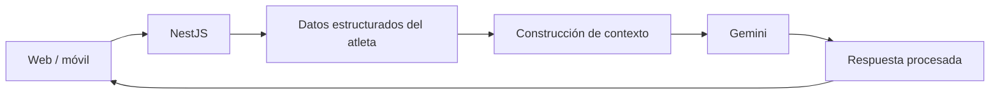

# Flujo de IA — futuro, no implementado

No existe endpoint de IA: `GeminiAiProvider` rechaza como no implementado. En la fase
futura, PRs, porcentajes y estadísticas se calcularán en código determinista; Gemini sólo
interpretará, explicará o redactará. `GEMINI_API_KEY` y `GEMINI_MODEL` son exclusivos del
servidor y nunca llegan a clientes.
