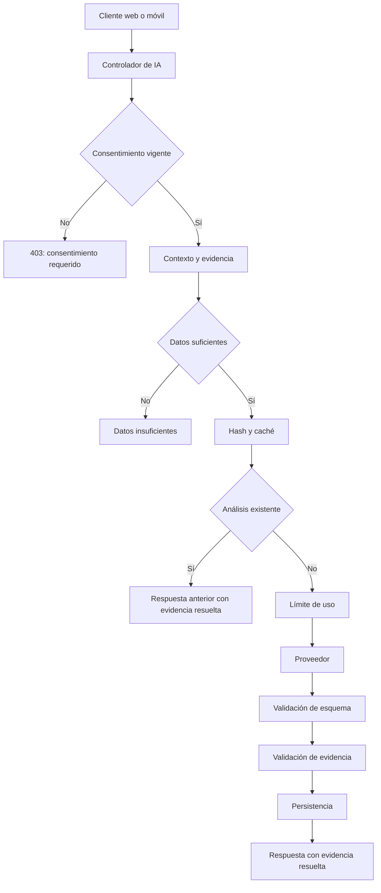

# Flujo de análisis explicativo con IA

La fase 4 incorpora una capa explicativa, no un motor de cálculo deportivo. Rendimiento, volumen, marcas y estructura de entrenamientos se calculan previamente en el dominio; el modelo redacta una interpretación a partir de hechos acotados. Esta separación aplica la decisión aceptada en [ADR 0009](../adr/0009-ai-analysis-architecture.md): GarFit calcula, el modelo interpreta y GarFit verifica antes de presentar un resultado.

## Secuencia de control

El controlador recibe una operación de progreso, entrenamiento, WOD o movimiento. Antes de solicitar una generación, el servicio comprueba el consentimiento y construye sólo el contexto pertinente. Si faltan datos, responde sin invocar al proveedor ni consumir cuota. Para una entrada suficiente, serializa establemente tipo, objetivo, periodo, versión de instrucción y hechos; el hash permite recuperar un resultado idéntico ya persistido.

Cuando no existe caché, se aplica el límite por atleta e instancia. La respuesta debe ajustarse al esquema estructurado y cada identificador citado debe pertenecer a la evidencia enviada. Una cita desconocida provoca un único reintento correctivo y el rechazo total si persiste. Sólo entonces se persiste el análisis y el cliente recibe valores resueltos desde los hechos de GarFit, nunca valores inventados por el modelo.

## Frontera del proveedor y simulación

El servicio depende de `AiProvider`, una frontera abstracta con estado de configuración y generación normalizada. `GeminiAiProvider` concentra el SDK `@google/genai`, el timeout y la salida estructurada; sus tipos no atraviesan la capa de negocio. El SDK no reintenta internamente, pues el servicio controla un único reintento verificable.

`FakeAiProvider` implementa el mismo contrato para pruebas y recorridos de extremo a extremo sin Internet. Permite comprobar consentimiento, caché, validación, aislamiento y presentación con resultados deterministas; no sustituye la integración real. La comprobación con Gemini real permanece pendiente mientras no haya una clave configurada.

## Datos y trazabilidad

Cada observación devuelve referencias a hechos de evidencia con identificadores estables. La interfaz muestra el texto generado junto con esos datos y el resumen de datos usados. Esto permite inspeccionar la base de una afirmación y evita que el modelo sea fuente de cifras deportivas.
