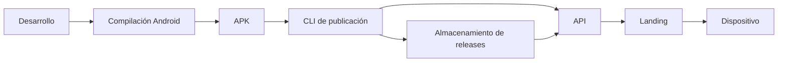

# Distribución Android

La distribución de fase 5 genera el proyecto nativo desde Expo, compila localmente el APK y lo publica con la CLI de la API. La CLI calcula el checksum y el tamaño antes de registrar la release; la landing consulta la API y conserva una URL estable para el QR.

El APK no se versiona en Git. La descarga versionada y la estable se sirven desde la API con el SHA-256 registrado, mientras que la landing presenta metadatos, instrucciones y QR. La instalación física sigue PENDIENTE de un dispositivo o emulador.
