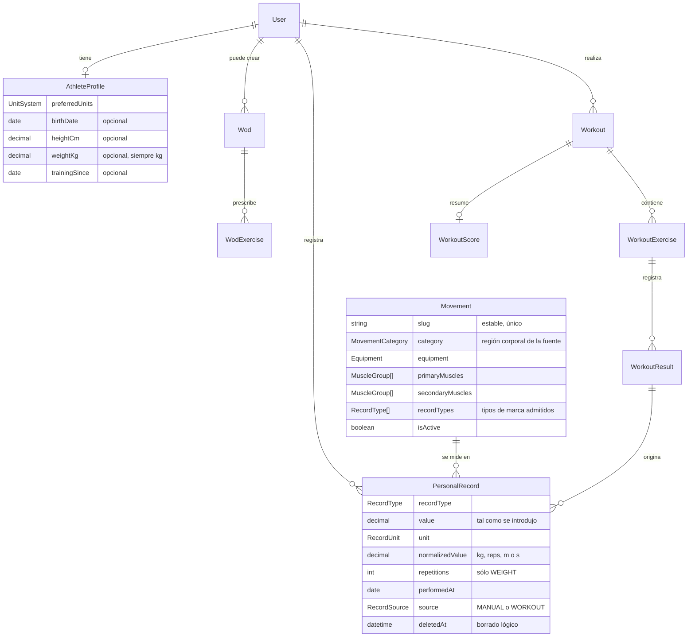
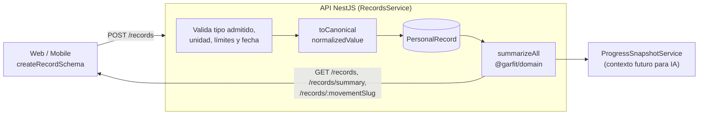
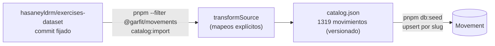

# Dominio del atleta (fases 2 y 3)

Este documento describe el núcleo deportivo implementado en la fase 2: el atleta, su perfil,
el catálogo de movimientos y las marcas personales con su progreso. Refleja el código de
`apps/api/prisma/schema.prisma`, `packages/domain` y `packages/movements`. El diagrama
entidad-relación completo se genera en [`docs/generated/database/erd.svg`](../generated/database/erd.svg).

## Modelo conceptual

Un atleta (`User`) tiene como máximo un perfil deportivo y cualquier número de marcas. Cada
marca pertenece a un movimiento del catálogo. Las marcas nunca se sobrescriben: la evolución se
obtiene de la secuencia de registros. Las razones del modelo están en el
[ADR 0007](../adr/0007-personal-record-model.md).

## Del registro al progreso

La validación ocurre dos veces: en el cliente con `@garfit/validation` (comodidad) y en la API
(frontera de confianza), ambas con las mismas reglas de `@garfit/domain`. Las consultas de marcas
se filtran siempre por el usuario del token; un identificador ajeno responde 404.

## Series y cálculos

Las marcas se agrupan en **series comparables**: mismo movimiento y tipo y, en peso, mismas
repeticiones. Para cada serie `@garfit/domain` calcula de forma determinista:

| Resultado | Definición |
| --- | --- |
| `best` | Mejor valor histórico según la dirección del tipo (en `TIME`, el menor). |
| `current` | Registro más reciente por fecha de realización. |
| `changeFromPrevious` | Cambio del penúltimo al último registro. |
| `bestImprovement` | Cuánto superó la mejor marca a la mejor marca previa. |
| `totalProgress` | Cambio del primer registro a la mejor marca. |
| `isPersonalBest` | Si cada registro superó a todos los anteriores al registrarse. |

Los cambios se expresan en unidad canónica con su porcentaje (nulo si la base es 0) y un
indicador `improved`. Ninguno de estos cálculos usa IA.

## Catálogo de movimientos

## Entrenamientos y marcas derivadas (fase 3)

Un `Wod` es una plantilla pública o privada; un `Workout` es una sesión personal que conserva la copia de la prescripción. Sus resultados por serie pueden generar `PersonalRecord` de origen `WORKOUT` al completar. La comparación es estricta y `TIME` se agrupa por `distanceMeters`; por ello un tiempo de 5 km no se compara con uno de 10 km. La transacción conserva el origen y, si se elimina la sesión, retira lógicamente sus marcas. El detalle normativo se encuentra en [ADR 0008](../adr/0008-workout-result-model.md), sin duplicar el ERD.

Sólo se importan datos cubiertos por la licencia MIT de la fuente (nombres, músculos,
equipamiento e instrucciones en español). La media de la fuente está excluida y no se usa. La
semilla es idempotente y desactiva, sin borrar, los movimientos que dejan de estar en el
catálogo, porque pueden tener marcas asociadas.
