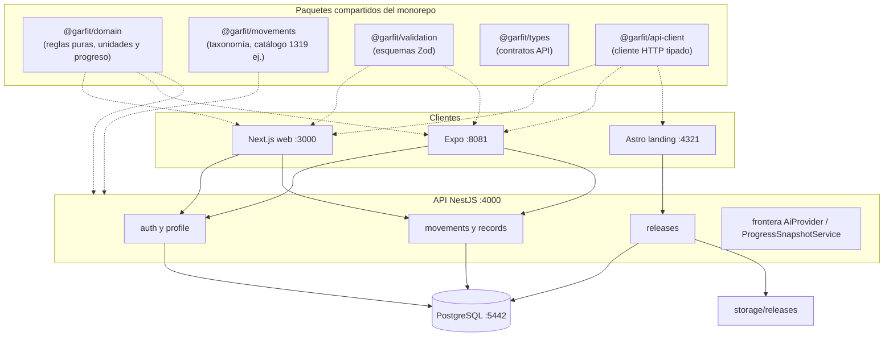

# Contenedores

Los paquetes internos `@garfit/domain`, `@garfit/movements`, `@garfit/types`, `@garfit/validation` y `@garfit/api-client` estructuran la lógica de negocio y comunicación sin duplicar definiciones:
- `@garfit/domain` concentra reglas de negocio universales (límites, enums, conversiones exactas de unidades y cálculo determinista de marcas y progreso), siendo consumido por la API y los clientes web y móvil.
- `@garfit/movements` provee la taxonomía del catálogo, reglas de derivación de marcas y el catálogo curado reproducible con 1319 movimientos para la siembra de la base de datos.
- `@garfit/types`, `@garfit/validation` y `@garfit/api-client` permiten compartir contratos y validación ergonómica en clientes, mientras la API mantiene su propia validación estricta de frontera mediante DTOs y class-validator.

El diagrama muestra responsabilidades, paquetes y puertos locales de desarrollo, no una topología de despliegue en producción. La decisión de concentrar el acceso a los datos en la API NestJS preserva el aislamiento y la autorización por usuario; la base de datos PostgreSQL y el almacenamiento de binarios no son accesibles directamente desde los clientes.

