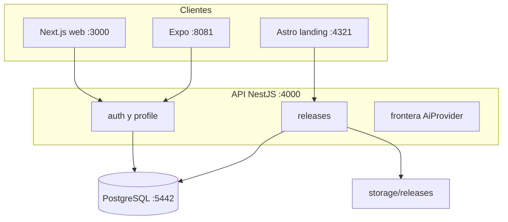

# Contenedores

Los paquetes internos `types`, `validation` y `api-client` se consumen en clientes; API
mantiene su propia validación de frontera.

El diagrama muestra responsabilidades y puertos locales, no una topología de producción. La decisión de concentrar datos en API evita accesos directos de clientes; el riesgo es que disponibilidad y configuración de API condicionen todos los recorridos. Los contratos compartidos reducen divergencia, sin reemplazar validación de servidor.
