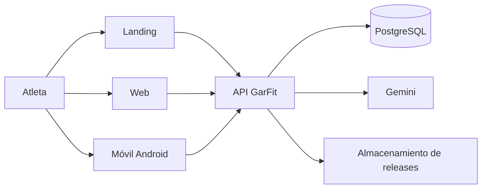

# Arquitectura final

Este documento resume la arquitectura del release candidate para exposición. Los detalles se mantienen en [contexto](system-context.md), [contenedores](containers.md), [flujo de IA](ai-flow.md), [distribución Android](android-distribution.md) y los [ADR 0001–0010](../adr/README.md).

## Contexto



Gemini es una dependencia externa y su llamada real requiere clave; la landing sólo consulta la release publicada y no almacena binarios.

## Contenedores

```mermaid
flowchart TB
  subgraph Clientes
    L[Landing Astro]
    W[Web Next.js]
    M[Móvil Expo / React Native]
  end
  subgraph API[API NestJS]
    AUTH[Auth y perfil]
    SPORT[Movimientos, marcas, entrenamientos y WODs]
    AI[IA: consentimiento, evidencia y AiProvider]
    REL[Releases]
  end
  subgraph Compartidos
    D[@garfit/domain]
    V[@garfit/validation y @garfit/types]
    C[@garfit/api-client]
  end
  DB[(PostgreSQL)]
  G[Google Gemini]
  S[ReleaseStorage]
  L --> REL
  W --> AUTH & SPORT & AI
  M --> AUTH & SPORT & AI
  AUTH --> DB
  SPORT --> DB
  AI --> DB
  AI --> G
  REL --> DB
  REL --> S
  D -. reglas deterministas .-> SPORT
  D -. hechos .-> AI
  V -. contratos .-> W
  V -. contratos .-> M
  C -. HTTP tipado .-> W
  C -. HTTP tipado .-> M
```

## Flujo de datos: entrenamiento, marcas y análisis

1. El atleta registra y completa un entrenamiento mediante web o móvil; la API valida propiedad, estado y resultados, y persiste la sesión en PostgreSQL.
2. La API deriva las marcas comparables desde las series completadas y conserva su origen de entrenamiento; el dominio calcula unidades, mejoras y comparaciones de forma determinista.
3. Con consentimiento, el atleta solicita un análisis. La API construye el contexto mínimo a partir de perfil, entrenamientos y marcas, conserva los hechos utilizados como evidencia y sólo entonces delega la interpretación a `AiProvider`.
4. La respuesta se valida antes de guardarse. Web y móvil presentan el análisis junto con su evidencia e historial; el proveedor no sustituye los cálculos de GarFit.
