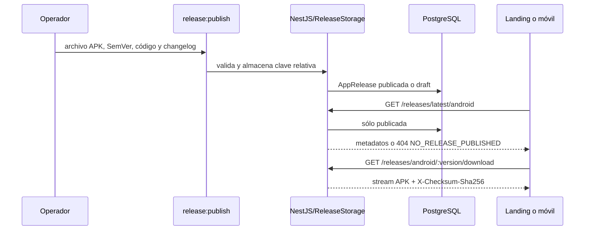

# Flujo de releases Android

```mermaid
sequenceDiagram
  participant O as Operador
  participant CLI as release:publish
  participant A as NestJS/ReleaseStorage
  participant D as PostgreSQL
  participant U as Landing o móvil
  O->>CLI: archivo APK, SemVer, código y changelog
  CLI->>A: valida y almacena clave relativa
  A->>D: AppRelease publicada o draft
  U->>A: GET /releases/latest/android
  A->>D: sólo publicada
  A-->>U: metadatos o 404 NO_RELEASE_PUBLISHED
  U->>A: GET /releases/android/:version/download
  A-->>U: stream APK + X-Checksum-Sha256
```

No hay endpoint de publicación ni rol admin. El almacenamiento local valida segmentos,
contención y symlinks; `ReleaseStorage` permite reemplazarlo por S3/R2.
