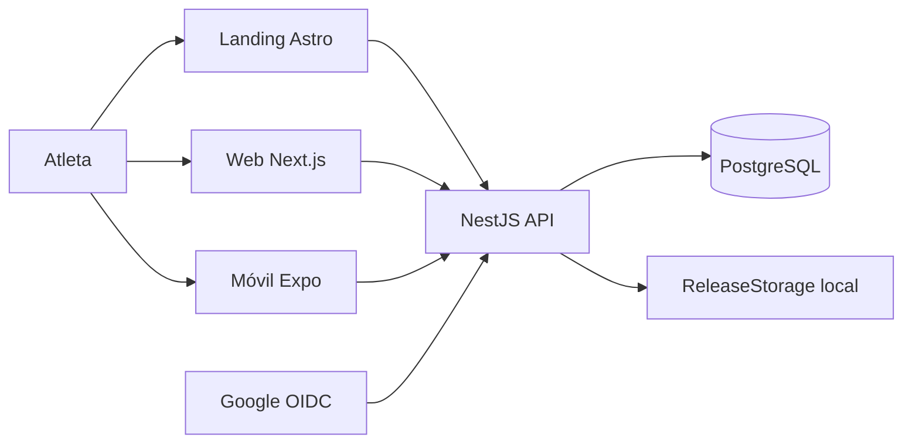

# Contexto del sistema

La landing informa y consulta APK; web y móvil consumen la API. Google sólo entrega el ID
token al cliente: la validación sucede en API. La IA está delimitada, pero no expone ruta.
