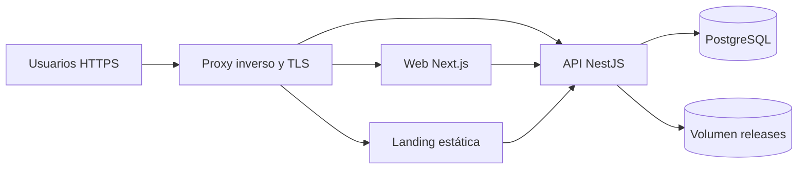

# Despliegue de GarFit

La composición de demostración reproduce el sistema sin modificar el entorno de desarrollo. La API aplica las migraciones de Prisma mediante `prisma migrate deploy` en su comando de arranque, antes de iniciar NestJS. Este comando sólo ejecuta migraciones versionadas y no genera cambios de esquema.



## Variables y arranque

Copie `.env.demo.example` a `.env.demo` y defina `POSTGRES_PASSWORD` y `JWT_ACCESS_SECRET` con valores privados; este último debe tener al menos 32 caracteres. Defina también `PUBLIC_API_URL`, `PUBLIC_WEB_APP_URL` y `CORS_ORIGINS` con las URL HTTPS finales. Las URLs públicas se compilan en la landing; `API_URL=http://api:4000` es exclusivamente la ruta interna de la web hacia la API.

```sh
cp .env.demo.example .env.demo
docker compose -f docker-compose.demo.yml up --build -d
docker compose -f docker-compose.demo.yml ps
curl -fsS http://localhost:4000/health
```

`NODE_ENV=development` sirve al trabajo local; `test` conserva la configuración local pero desactiva el límite de peticiones para la suite; `demo` mantiene el límite y permite `AI_PROVIDER=fake`; `production` mantiene el límite, prohíbe ese proveedor y exige `CORS_ORIGINS` no vacío y sin `*`. `SWAGGER_ENABLED` debe activarse sólo cuando la documentación pública sea deliberada. La web marca sus cookies HttpOnly, SameSite=Lax y host-only; en producción Next.js añade `Secure`, mientras localhost HTTP continúa funcionando.

## Proxy y TLS

Coloque un proxy inverso externo delante de los puertos 3000, 8080 y 4000, termine TLS allí y reenvíe cabeceras `Host` y `X-Forwarded-Proto`. Publique normalmente la web y la landing; exponga la API sólo si la landing o clientes móviles la requieren. El proxy no requiere proveedor concreto, pero debe redirigir HTTP a HTTPS y emitir certificados válidos. Actualice `PUBLIC_API_URL`, `PUBLIC_WEB_APP_URL` y `CORS_ORIGINS` con los dominios finales antes de construir la landing.

El volumen `garfit-demo-releases` monta `/data/releases`; contiene APK publicadas y debe preservarse al recrear contenedores. No ejecute `docker compose down -v` salvo que pretenda borrar también la base y las releases.

## Comprobación posterior

Verifique que `GET /health` devuelve `status: "ok"` y `database: "up"`. El endpoint sigue respondiendo `200` con `degraded` si PostgreSQL falla: por tanto el healthcheck de Compose inspecciona además `database`. Esta comprobación no usa Gemini. Revise `docker compose -f docker-compose.demo.yml logs api`, abra web y landing a través del proxy HTTPS y descargue una APK de prueba si existe una release publicada.
